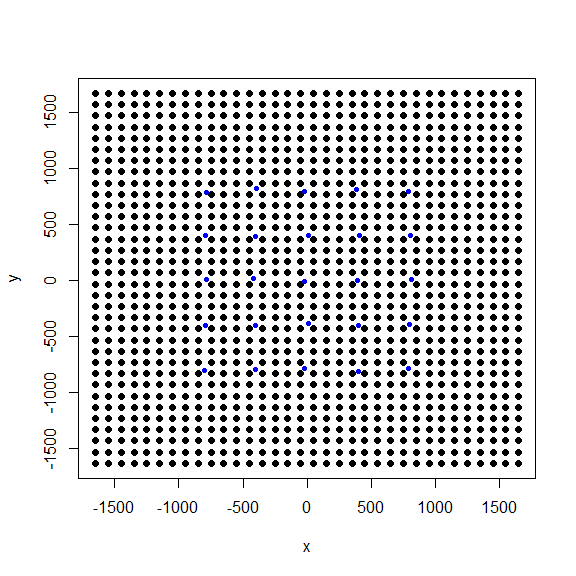
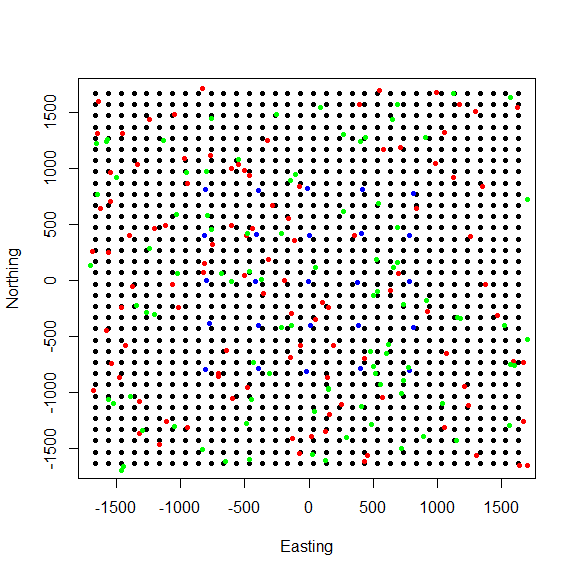
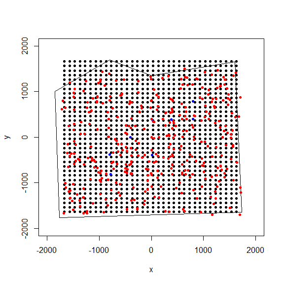
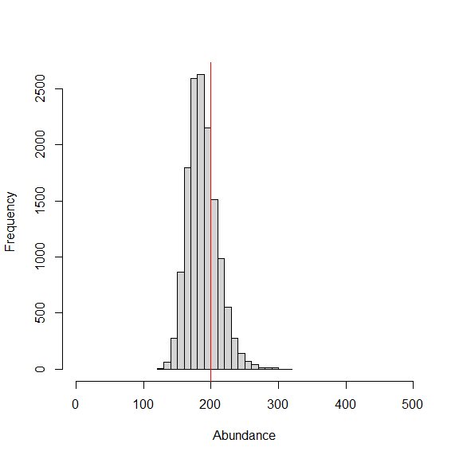

<!-- README.md is generated from README.Rmd. Please edit that file -->

# localSCR

<!-- badges: start -->

<!-- badges: end -->

The goal of ‘localSCR’ is to provide user-friendly functions to
implement spatially-explicit mark recapture (SECR) models using the
‘nimble’ package in R. The package currently has functions to 1)
assist with defining the state-space grid and extent for a given
2-dimensional or 3-dimensional trap array (i.e., when traps are
clustered in space), 2) simulate data under different encounter
distributions and other parameters, 3) create habitat masks from either
raster data or spatial polygons, 4) provide template SECR models that
are easily customizable, and 4) fit and summarize SECR models using
nimble with options for parallel processing. Future functionality will
include creating realized density surfaces from MCMC output and
implementing localized approaches as in Milleret et al. (2019) and
Woodruff et al. (2020). The package also uses block updating of x-and y-
activity center coordinates to decrease run time.

Another useful package is ‘nimbleSCR’ (Bischof et al. 2021) that
implements custom sampling distributions to increase sampling speed and
efficiency and recent methods of localized activity area approaches (see
Milleret et al. 2019) along with other custom functionality. These
custom distributions from ‘nimbleSCR’ can be used within our template
models, but the idea with the ‘localSCR’ package is to provide a more
user-friendly implemention of SECR models in ‘nimble’ similar to the
functionality provided by the ‘jagsUI’ package (Keller 2019) for JAGS
(Plummer 2017). Our intention is to ease the transition for users that
were previously using JAGS or those that have yet to switch over to
Bayesian methods from frequentist because of the complexity of
implementing these approaches.

## Installation

You can install the development version of ‘localSCR’ like so:

``` r
library(remotes)
install_github("sitkensis22/localSCR")
#> Skipping install of 'localSCR' from a github remote, the SHA1 (f53d932a) has not changed since last install.
#>   Use `force = TRUE` to force installation
```

Be sure to see important information about using ‘nimble’ on your
computer (including installing rtools): <https://r-nimble.org/download>

## Example

This is a basic example which shows you a workflow for a uniform
state-space with a habitat mask:

``` r

# load package
library(localSCR)
```

## (1) Simulate a single trap array with random positional noise and create state-space

``` r

# simulate a single trap array with random positional noise
x <- seq(-800, 800, length.out = 5)
y <- seq(-800, 800, length.out = 5)
traps <- as.matrix(expand.grid(x = x, y = y))
traps <- traps + runif(prod(dim(traps)),-20,20) # add some random noise to locations

mysigma = 300 # simulate sigma of 300 m
mycrs = 32608 # EPSG for WGS 84 / UTM zone 8N

# create state-space
Grid = grid_classic(X = traps, crs_ = mycrs, buff = 3*mysigma, res = 100)

# make plot of grid and trap locations
par(mfrow=c(1,1))
plot(Grid$grid, pch=19)
points(traps, col="blue",pch=20)
```



## (2) Simulate SCR data and make a plot of it.

``` r

# simulate SCR data
data3d = sim_classic(X = traps, ext = Grid$ext, crs_ = mycrs, sigma_ = mysigma, prop_sex = 1,
N = 200, K = 4, base_encounter = 0.25, enc_dist = "binomial", hab_mask = FALSE, setSeed = 50)

# inspect simulated data
str(data3d)
#> List of 3
#>  $ y  : int [1:200, 1:25, 1:4] 0 0 0 0 0 0 0 0 0 0 ...
#>  $ sex: int [1:200] 1 1 1 1 1 1 1 1 1 1 ...
#>  $ s  : num [1:200, 1:2] 718.8 -206.2 -1017.1 917.9 51.5 ...
#>   ..- attr(*, "dimnames")=List of 2
#>   .. ..$ : NULL
#>   .. ..$ : chr [1:2] "sx" "sy"


# make simple plot
par(mfrow=c(1,1))
plot(Grid$grid, pch=20,ylab="Northing",xlab="Easting")
points(traps, col="blue",pch=20)
points(data3d$s,col="red",pch = 20) # all simulated activity centers
points(data3d$s[which(apply(data3d$y,1,sum)!=0),],col="green",pch = 20) # detected individuals
```



# (3) Workflow for simple SCR model with sex-specific sigma, binomial encounter distribution, and habitat mask

``` r

# simulate a single trap array with random positional noise
x <- seq(-800, 800, length.out = 5)
y <- seq(-800, 800, length.out = 5)
traps <- as.matrix(expand.grid(x = x, y = y))
traps <- traps + runif(prod(dim(traps)),-20,20) # add some random noise to locations

mysigma = c(220, 300) # simulate sex-specific
mycrs = 32608 # EPSG for WGS 84 / UTM zone 8N
pixelWidth = 100 # store pixelWidth

# create state-space grid and extent
Grid = grid_classic(X = traps, crs_ = mycrs, buff = 3*max(mysigma), res = pixelWidth) 

# create polygon for mask
library(sf)
#> Linking to GEOS 3.9.1, GDAL 3.2.1, PROJ 7.2.1; sf_use_s2() is TRUE
poly = st_sfc(st_polygon(x=list(matrix(c(-1765,-1765,1730,-1650,1600,1650,0,1350,-800,1700,
-1850,1000,-1765,-1765),ncol=2, byrow=TRUE))), crs =  mycrs)

# create habitat mask
hab_mask = mask_polygon(poly = poly, grid = Grid$grid, crs_ = mycrs, prev_mask = NULL)

# simulate data for uniform state-space and habitat mask
data3d = sim_classic(X = traps, ext = Grid$ext, crs_ = mycrs, sigma_ = mysigma, prop_sex = 0.7,
N = 200, K = 4, base_encounter = 0.15, enc_dist = "binomial",hab_mask = hab_mask, setSeed = 50)

# get initial activity center starting values
s.st3d = initialize_classic(y=data3d$y, M=400, X=traps, buff = 3*max(mysigma), hab_mask = hab_mask)

# make simple plot
par(mfrow=c(1,1))
plot(Grid$grid, pch=20, xlim=c(-2000,2000),ylim=c(-2000,2000))
points(traps, col="blue",pch=20)
plot(poly, add=TRUE)
points(s.st3d,col="red",pch=20) # all initalized activity centers
```



``` r

# rescale inputs
rescale_list = rescale_classic(X = traps, ext = Grid$ext, s.st = s.st3d, hab_mask = hab_mask)

# store rescaled extent
ext = rescale_list$ext

# prepare data
data = list(y=data3d$y)
data$y = data$y[which(apply(data$y, 1, sum)!=0),,] # remove augmented records 
data$y = apply(data$y, c(1,2), sum) # covert to 2d by summing over occasions

# add rescaled traps
data$X = rescale_list$X

# prepare constants (note get density in km2 rather than m2)
constants = list(M = 400,n0 = nrow(data$y),J=dim(data$y)[2], K=dim(data3d$y)[3],
x_lower = ext[1], x_upper = ext[2], y_lower = ext[3], y_upper = ext[4],
sigma_upper = 1000, A = (sum(hab_mask)*(pixelWidth/1000)^2),pixelWidth=pixelWidth)

# augment sex
data$sex = c(data3d$sex,rep(NA,constants$M-length(data3d$sex)))

# add z and zeros vector data for latent inclusion indicator
data$z = c(rep(1,constants$n0),rep(NA,constants$M - constants$n0))
data$zeros =  c(rep(NA,constants$n0),rep(0,constants$M - constants$n0))

# add hab_mask and OK for habitat check
data$hab_mask = hab_mask
data$OK = rep(1,constants$M)

# get initial activity center starting values
s.st3d = rescale_list$s.st

# define all initial values
inits = list(sigma = runif(2, 250, 350), s = s.st3d,psi=runif(1,0.2,0.3),
p0 = runif(1, 0.05, 0.15),pOK=data$OK,z=c(rep(NA,constants$n0),rep(0,constants$M-constants$n0)))

# parameters to monitor
params = c("sigma","psi","p0","N","D","psi_sex")

# get model
scr_model = get_classic(dim_y = 2, enc_dist = "binomial",sex_sigma = TRUE,hab_mask=TRUE)

# run model
library(tictoc)
tic() # track time elapsed
out = run_classic(model = scr_model, data=data, constants=constants,
inits=inits, params = params,niter = 8000, nburnin=1000, thin=1, nchains=2, parallel=TRUE, RNGseed = 500)
toc()
#> 135.83 sec elapsed

# summarize output
samples = do.call(rbind, out)
par(mfrow=c(1,1))
hist(samples[,which(dimnames(out[[1]])[[2]]=="N")], xlab = "Abundance", xlim = c(0,500), main="")
abline(v=200, col="red") # add line for simulated abundance
```



``` r

# summarize MCMC samples
nimSummary(out)
#>          post.mean post.sd    q2.5     q50   q97.5 f0   n.eff  Rhat
#> D           17.589   2.090  14.125  17.399  22.173  1 418.686 1.094
#> N          188.025  22.345 151.000 186.000 237.025  1 418.686 1.094
#> p0           0.163   0.028   0.113   0.161   0.226  1 378.397 1.005
#> psi          0.470   0.061   0.368   0.464   0.604  1 418.875 1.097
#> psi_sex      0.656   0.067   0.510   0.660   0.779  1 291.554 1.047
#> sigma[1]   240.303  28.402 190.739 238.009 303.667  1 369.615 1.038
#> sigma[2]   289.768  26.314 247.440 286.715 349.694  1 234.498 1.003
```

## Literature Cited

Bischof R., D. Turek, C. Milleret, T. Ergon, P. Dupont, S. Dey, W. Zhang
and P. de Valpine. 2021. nimbleSCR: Spatial Capture-Recapture (SCR)
Methods Using ‘nimble’. R package version 0.1.3.
<https://CRAN.R-project.org/package=nimbleSCR>.

Kellner, K. 2018. jagsUI: a wrapper around ‘rjags’ to streamline ‘JAGS’
analyses. R package version 1.5.0.
<https://CRAN.R-project.org/package=jagsUI>.

Milleret, C., P. Dupont, C. Bonenfant, H. Henrik Brøseth, Ø. Flagstad,
C. Sutherland, and R. Bischof. 2019. A local evaluation of the
individual state‐space to scale up Bayesian spatial capture‐recapture.
Ecology and Evolution 9:352–363.

Plummer, M. 2017. JAGS version 4.3.0. user manual.
<https://people.stat.sc.edu/hansont/stat740/jags_user_manual.pdf>.

Woodruff, S., D. R. Eacker, and L. Waits. 2020. Estimating coyote
density in local, discrete Bayesian capture-recapture models. Journal of
Wildlife Management 10.1002/jwmg.21967
