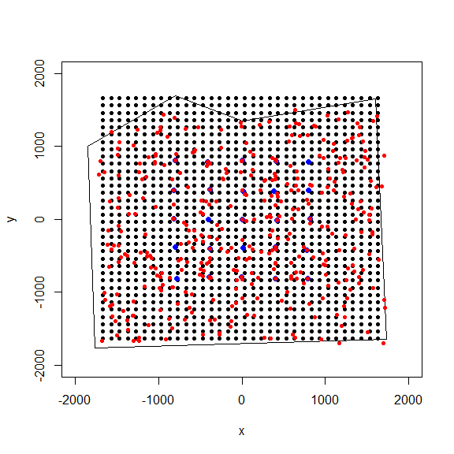
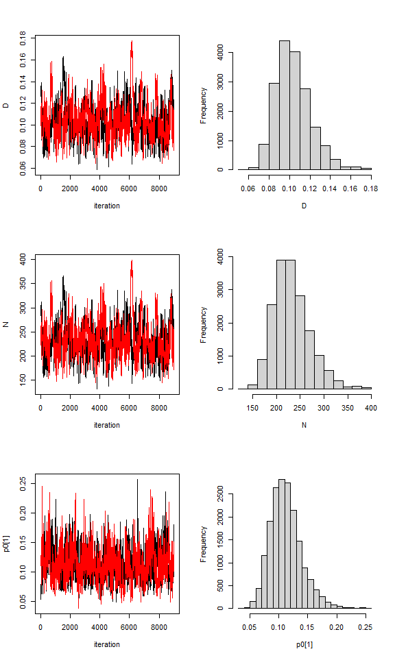

```{r, include = FALSE}
knitr::opts_chunk$set(
  collapse = TRUE,
  comment = "#>"
)
```

## Introduction
<p>
The first vignette of the 'localSCR' package covers what I define as a set of 'classic' Bayesian spatial capture-recapture (SCR) models (Royle et al. 2014). These models are designed to model SCR data for 'marked' individuals under the assumption of uniformly distributed activity centers (i.e,. a continuous state-space). Although many distance detection functions are possible, the package currently only models the encounter process under the assumption of a bivariate normal model of space use, which is commonly employed in the literature. The package is meant to ease implementation of Bayesian SCR models using the 'nimble' package (de Valpine et a. 2022), which allows for increased flexibilty with the ability for the user to include custom functions and assign different algorithms to specific model parameters. I took advantage of this functionality with the goal of building a simple, straightforward workflow that was flexible enough to handle most mainstream SCR analysis problems. Visit <https://r-nimble.org/download> for information on installing 'nimble' and Rtools on your computer.
</p>
## Implementation
<p>
The 'localSCR' package implements Bayesian SCR models using the 'nimble' package (de Valpine et a. 2022) following methods described in Royle et al. (2014). We take advantage of recent developments in computation of SCR models. In this tutorial, three methods are implemented to decrease computational run time:

1) Block updating of x and y activity center coordinates (Turek et al. 2021)
2) Using vectorized declarations for traps in distance function calculations
3) Separating the data augmentation process into two steps (Chandler 2018)

In some SCR problems, there are landscape features that create 'unsuitable' habitat for the study species. Habitat masks are used to account for these features and designate suitable (1) or unsuitable (0) habitat, and can be represented as a matrix or array of binary values. We follow the methods of Milletet et al. (2019) to implement the "ones" trick to account for habitat suitability. This restricts the possible locations of latent activity centers to only suitable habitat. The 'localSCR' package provides functions to construct a habitat mask from either raster or polygon data. 

Finally, in some SCR designs, trap arrays may be spread out over the study area such that individuals can only be detected at one of multiple trap arrays (e.g., Furnas et al. 2018). This necessitates including the traps as a 3-dimensional array, using a site identifier to track which site a detected or augmented individual belongs to, and using a dynamic indexing in the model. 
</p>

<p>
## Turtorial

This tutorial includes four parts:

1) Create traps (or detectors) and then construct a state-space
2) Simulate 'classic' SCR data using state-space extent 
3) Workflow for 2-D trap array including sex-specific scaling parameter and habitat mask
4) Workflow for 3-D trap array including sex-specific scaling parameter and habitat mask
</p>
<br>

<p>
## Functions used from 'localSCR' package:
* `grid_classic()` define state-space grid and extent 
* `sim_classic()` simulate basic spatial capture-recapture data
* `mask_polygon()` create habitat mask matrix or array from polygon
* `initialize_classic()` generate starting locations for activity area centers
* `rescale_classic()` rescale inputs to prepare data for using habitat mask
* `get_classic()` grabs template model for given inputs using the `nimbleCode()` function
* `run_classic()` wrapper function to run classic models using 'nimble' package
* `nimSummary()` summarize lists of Markov Chain Monte Carlo (MCMC) output
* `realized_density()` generate realized density surface from MCMC output
</p>
<br>
<b> <i>Note: see references at bottom of page</i></b>


```{r setup}
# load 'localSCR' package
library(localSCR)
```

### (1) Simulate a single trap array with random positional noise and create state-space

```{r, fig.show='hide'}
# simulate a single trap array with random positional noise
x <- seq(-800, 800, length.out = 5)
y <- seq(-800, 800, length.out = 5)
traps <- as.matrix(expand.grid(x = x, y = y))
traps <- traps + runif(prod(dim(traps)),-20,20) # add some random noise to locations

mysigma = 300 # simulate sigma of 300 m
mycrs = 32608 # EPSG for WGS 84 / UTM zone 8N

# create state-space
Grid = grid_classic(X = traps, crs_ = mycrs, buff = 3*mysigma, res = 100)

# make ggplot of grid and trap locations
library(ggplot2)
ggplot() + geom_point(data=as.data.frame(Grid$grid),aes(x=x,y=y),color="grey60",size=1.25) + 
    geom_point(data=as.data.frame(traps),aes(x=x,y=y),color="blue",size=2) +
    theme_classic() + ylab("Northing") + xlab("Easting") +
    scale_x_continuous(expand=c(-0.1, 0.1)) + 
    scale_y_continuous(expand=c(-0.1, 0.1)) + 
    theme(axis.text = element_text(size=12),axis.title = element_text(size=16))
```

<p align="center" >
  
</p>

<p>
Here, we can see the state-space grid that was created from `grid_classic()`. Also, the traps (or detectors) are plotted over top in blue. We arbitrarily chose a grid resolution of 100 in this example (i.g., `res = 100`), but this will vary by problem. In most situations, it is prudent to test the effect of different grid resolutions on the estimated abundance and density in SCR models (see Royle et al. 2014). Also, note the use to the EPSG code to define the coordinate reference system for our state-space (see <https://epsg.io/32608>). 

Now lets simulate some spatial capture-recapture data using `sim_classic()`. Note for this example, we will simulate a 'true' population size of 200 individuals (`N = 200`), 4 sampling occasions (`K = 4`), a scaling parameter (`sigma_`) of 300 m, a baseline encounter probability of 0.10 (`base_encounter = 0.10`), no sex-specificity (`prop_sex = 1`), and no habitat mask (`hab_mask = FALSE`). We also use `setSeed = 100` to make the simulate reproducible. We provide the function the extent of the state-space output from `grid_classic()` as 'ext = Grid$ext'. Note that Grid is a list here.
</p>

### (2) Simulate SCR data and make a plot of it.

```{r, fig.show='hide'}
# simulate SCR data
data3d = sim_classic(X = traps, ext = Grid$ext, crs_ = mycrs, sigma_ = mysigma, prop_sex = 1,
N = 200, K = 4, base_encounter = 0.10, enc_dist = "binomial", 
hab_mask = FALSE, setSeed = 100)

# inspect simulated data
str(data3d)

# bind simulated activity centers with vector of the number of individual detections
sdata = as.data.frame(cbind(data3d$s,Ndet=apply(data3d$y,1,sum)))
 
# make ggplot
ggplot() + geom_point(data=as.data.frame(Grid$grid),aes(x=x,y=y),color="grey60",size=1.25) + 
    geom_point(data=as.data.frame(traps),aes(x=x,y=y),color="blue",size=2) +
    geom_point(data=sdata,aes(x=sx,y=sy,size=Ndet),color="orangered",alpha=0.75) +
    theme_classic() + ylab("Northing") + xlab("Easting") +
    scale_x_continuous(expand=c(0.025, 0.025)) +  scale_size_continuous(range = c(2, 7)) + 
    scale_y_continuous(expand=c(0.025, 0.025)) + 
    theme(axis.text = element_text(size=12),axis.title = element_text(size=16))
```

<p align="center">
  
</p>
<p>
In the plot we can see the point sizes are relative to the number of detections ('Ndet') for each simulated individual. Although most individuals detected near or on the grid have a large number of detections, we still pick up some individuals multiple times on the edge of the grid just by chance. Also, the point pattern appears random because we are drawing simulated activity center coordinates using `runif()`, which adheres to our assumption of a random distribution of individual activity centers across the state-space in our classis SCR analysis. 

Next, we'll create the same trap array but we'll set a sex-specific scaling parameter (`sigma_`) of 220 m and 300 m, which could represent a smaller female and larger male activity area sizes. In order to fully-specify a sex-specific scaling parameter in `sim_classic()`, we need to set `0 > prop_sex < 1`, otherwise the simulation will only use a single scaling parameter. In the example, we also specify `enc_dist = "binomial` to use a binomial encounter probability model; the other available option is the Poisson distribution (`enc_dist = "poisson`). 

We add on an additional layer of complexity by introducing a habitat mask. After constructing a polygon feature using the 'sf' package, we then use the function `mask_polygon()` to build a habitat mask as a matrix object. The habitat matrix is either '0' (unsuitable) or '1' (suitable). In the habitat matrix the rows represent the y-coordinate ("Northing") of the state-space grid and the columns represent the x-coordinate ("Easting") of the state-space grid. We'll use this habitat matrix as data below in this part of the tutorial.

We also see the use of `initialize_classic()`, which automatically generates plausible starting activity center locations for all individuals. Note that for detected individuals, the function uses the mean capture location as the starting location while random locations are used for augmented individuals. Given our simulated population size of 200, we specify the total augmented population size (detected + augmented individuals) at 400 (`M = 400`).
</p>

### (3) Workflow for simple SCR model with sex-specific sigma, binomial encounter distribution, and habitat mask

```{r, fig.show='hide'}
# simulate a single trap array with random positional noise
x <- seq(-800, 800, length.out = 5)
y <- seq(-800, 800, length.out = 5)
traps <- as.matrix(expand.grid(x = x, y = y))
traps <- traps + runif(prod(dim(traps)),-20,20) # add some random noise to locations

mysigma = c(220, 300) # simulate sex-specific
mycrs = 32608 # EPSG for WGS 84 / UTM zone 8N
pixelWidth = 100 # store pixelWidth or grid resolution

# create state-space grid and extent
Grid = grid_classic(X = traps, crs_ = mycrs, buff = 3*max(mysigma), res = pixelWidth) 

# create polygon for mask
library(sf)
poly = st_sfc(st_polygon(x=list(matrix(c(-1765,-1765,1730,-1650,1600,1650,0,1350,-800,1700,
-1850,1000,-1765,-1765),ncol=2, byrow=TRUE))), crs =  mycrs)

# create habitat mask
hab_mask = mask_polygon(poly = poly, grid = Grid$grid, crs_ = mycrs, 
prev_mask = NULL)

# simulate data for uniform state-space and habitat mask
data3d = sim_classic(X = traps, ext = Grid$ext, crs_ = mycrs, sigma_ = mysigma, prop_sex = 0.7,
N = 200, K = 4, base_encounter = 0.15, enc_dist = "binomial",
hab_mask = hab_mask, setSeed = 100)

# total augmented population size 
M = 400

# get initial activity center starting values
s.st3d = initialize_classic(y=data3d$y, M=M, X=traps, buff = 3*max(mysigma), hab_mask = hab_mask)

# bind simulated activity centers with vector of either 1 (detected) or 0 (not detected)
s.stdata = as.data.frame(cbind(s.st3d,Det=c(as.numeric(apply(data3d$y,1,sum)>0),
rep(0,M-nrow(data3d$y)))))

# convert Det to factor
s.stdata$Det = as.factor(s.stdata$Det)
  
# make ggplot
ggplot() + geom_point(data=as.data.frame(Grid$grid),aes(x=x,y=y),color="grey60",size=1.25) + 
    geom_point(data=as.data.frame(traps),aes(x=x,y=y),color="blue",size=3) +
    geom_point(data=s.stdata,aes(x=V1,y=V2,fill=Det,color=Det),size = 2.5) +
    geom_sf(data=poly, fill = NA) + coord_sf(datum=st_crs(mycrs)) +
    theme_classic() + ylab("Northing") + xlab("Easting") +
    scale_x_continuous(expand=c(0.025, 0.025)) + 
    scale_color_manual(values = c("orangered","springgreen")) +
    scale_y_continuous(expand=c(0.025, 0.025)) + 
    theme(axis.text = element_text(size=12),axis.title = element_text(size=16))
```

<p align="center">
  
</p>
<p>
In the figure above we can see the effect of the polygon in creating a habitat mask for the state-space. The `initialize_classic()` function contains the initial activity center locations to within the polygon (note that those points on the edges were in suitable habitat when the continuous location were discretized and checked with the habitat mask). 

We now have most of the components we will need to analyze the simulated data set. However, because we are using a habitat mask in the model (`hab_mask`), we must rescale the traps, grid extent, and initial activity center locations. 
</p>

```{r, fig.show='hide'}
# rescale inputs
rescale_list = rescale_classic(X = traps, ext = Grid$ext, s.st = s.st3d, 
hab_mask = hab_mask)

# store rescaled extent
ext = rescale_list$ext

# prepare data
data = list(y=data3d$y)
data$y = data$y[which(apply(data$y, 1, sum)!=0),,] # remove augmented records 
data$y = apply(data$y, c(1,2), sum) # covert to 2d by summing over occasions

# add rescaled traps
data$X = rescale_list$X

# prepare constants (note get density in activity center/100 m2 rather than activity centers/m2)
constants = list(M = M,n0 = nrow(data$y),J=dim(data$y)[2], K=dim(data3d$y)[3],
x_lower = ext[1], x_upper = ext[2], y_lower = ext[3], y_upper = ext[4],
sigma_upper = 1000, A = (sum(hab_mask)*(pixelWidth/100)^2),pixelWidth=pixelWidth)

# augment sex
data$sex = c(data3d$sex,rep(NA,constants$M-length(data3d$sex)))

# add z and zeros vector data for latent inclusion indicator
data$z = c(rep(1,constants$n0),rep(NA,constants$M - constants$n0))
data$zeros =  c(rep(NA,constants$n0),rep(0,constants$M - constants$n0))

# add hab_mask and OK for habitat check
data$hab_mask = hab_mask
data$OK = rep(1,constants$M)

# get initial activity center starting values
s.st3d = rescale_list$s.st

# define all initial values
inits = list(sigma = runif(2, 250, 350), s = s.st3d,psi=runif(1,0.2,0.3),
p0 = runif(1, 0.05, 0.15),pOK=data$OK,z=c(rep(NA,constants$n0),
rep(0,constants$M-constants$n0)))

# parameters to monitor
params = c("sigma","psi","p0","N","D","psi_sex","s","z")

# get model
scr_model = get_classic(dim_y = 2, enc_dist = "binomial",sex_sigma = TRUE,hab_mask=TRUE,
trapsClustered=FALSE)

# run model
library(tictoc)
tic() # track time elapsed
out = run_classic(model = scr_model, data=data, constants=constants,
inits=inits, params = params,niter = 10000, nburnin=1000, thin=1, nchains=2, parallel=TRUE, 
RNGseed = 500)
toc()

# summarize output
samples = do.call(rbind, out)
par(mfrow=c(1,1))
hist(samples[,which(dimnames(out[[1]])[[2]]=="N")], xlab = "Abundance", xlim = c(0,500), main="")
abline(v=200, col="red") # add line for simulated abundance
```

<p align="center">
  
</p>
<p>
We can see from the histogram of the posterior samples of `N` that our model estimates were close to the simulated value of 200 individuals (shows by red line) and were biased slightly low at around 186 individuals. This is expected since this is only one realization of the detection process. In this example, we divided the pixelWidth by 100 in deriving the area (`A`) in our list of constants. This allowed us to estimate density in activity centers/100 m<sup>2</sup> rather than activity centers/m<sup>2</sup>. Note that care must be taken with any rescaling of the data or constants.

Next we use`nimSummary()` to quickly summarize the MCMC samples. Note that there are other options to summarize MCMC output, but this function is provided with the package and depends partly on the 'coda' package. Then, we make a realized density plot of the MCMC samples using `realized_density()`. In this function we make use of the list of grid and extent we created earlier called "Grid" as well as our saved coordinates reference system (`mycrs`). In this example, we use the 'raster' package to make a simple plot of the output. We can see that the habitat mask has resulted in some cells having `NA` values where the habitat was unsuitable.
</p>

```{r, fig.show='hide'}
# summarize MCMC samples (exclude parameters and don't plot)
nimSummary(out, exclude_params = c("s","z"), trace=FALSE)

# make realized density plot 
r = realized_density(samples = out, grid = Grid$grid, crs_ = mycrs, site = NULL, 
hab_mask = hab_mask)       
      
# load virdiis color palette and raster libraries      
library(viridis)
library(raster)

# make simple raster plot
plot(r, col=viridis(100),main=expression("Realized density (activity centers/100 m"^2*")"),
     ylab="Northing",xlab="Easting")
```

<p align="center">
  
</p>
<p>
Next we repeat a similar workflow but now we have two trap arrays that are clustered in space, and thus, there is a negligble chance of detecting an individual at more than one trap array. In this case, the functions in 'localSCR' can automatically detect that the traps are in a 3-dimensional format and we note that `sim_classic` will return a variable called `site` that identifies which trap array that each individual (both detected and augmented) belongs to. Note that the number of rows in the simulated data `y` will equal the simulated population size (here in the example, `N = 200`). However, because we are using a trick provided by Chandler (2018) to separate the data augmentation process into two steps, we only need the encounter data for those individuals that were detected in the model likelihood. Also, because we have no occasion-specific detection covariates, we can sum `y` over individuals and traps to result in a 2-dimensional encounter history array (i.e., `y[i,j]`). This speeds us the model under these conditions and we can specify this when we get the SCR model using `get_classic(y_dim = 2,...)` by setting `y_dim = 2`. Otherwise, the workflow is very similar to having a 2-dimensional trap array in the previous example.
</p>

### (4) Workflow for simple SCR model with sex-specific sigma, binomial encounter distribution, and habitat mask using a 3D trap array or clustered traps.

```{r, fig.show='hide'}
# simulate a single trap array with random positional noise
x <- seq(-800, 800, length.out = 5)
y <- seq(-800, 800, length.out = 5)
traps <- as.matrix(expand.grid(x = x, y = y))
traps <- traps + runif(prod(dim(traps)),-20,20) # add some random noise to locations

mysigma = c(220, 300) # simulate sex-specific
mycrs = 32608 # EPSG for WGS 84 / UTM zone 8N
pixelWidth = 100 # store pixelWidth

# create an array of traps, as an approach where individuals will only be detected 
# at one of the trap arrays (e.g., Furnas et al. 2018)
Xarray = array(NA, dim=c(nrow(traps),2,2))
Xarray[,,1]=traps
Xarray[,,2]=traps+4000 # shift trapping grid to new locations

# create grid and extent for 3D trap array
GridX = grid_classic(X = Xarray, crs_ = mycrs, buff = 3*max(mysigma), res = 100)

# create polygon to use as a mask
library(sf)
poly = st_sfc(st_polygon(x=list(matrix(c(-1660,-1900,5730,-1050,5470,
5650,0,6050,-1800,5700,-1660,-1900),ncol=2, byrow=TRUE))), crs =  mycrs)

# make ggplot
ggplot() + geom_point(data=as.data.frame(GridX$grid[,,1]),aes(x=V1,y=V2),color="grey60",size=1.25) +
    geom_point(data=as.data.frame(Xarray[,,1]),aes(x=V1,y=V2),color="blue",size=2) +
    geom_point(data=as.data.frame(GridX$grid[,,2]),aes(x=V1,y=V2),color="grey60",size=1.25) +
    geom_point(data=as.data.frame(Xarray[,,2]),aes(x=V1,y=V2),color="blue",size=2) +
    geom_sf(data=poly, fill = NA) + coord_sf(datum=st_crs(mycrs)) +
    theme_classic() + ylab("Northing") + xlab("Easting") +
    scale_x_continuous(limits=c(-2000,6000)) +
    scale_y_continuous(limits=c(-2000,6000)) + 
    theme(axis.text = element_text(size=12),axis.title = element_text(size=16))
```

<p align="center">
  
</p>
<p>
In the figure we can see our two spatially separated trapping grids and that the polgon overlaps some of the grided area. The area outside the polygon will be considere unsuitable when the habitat matrix is created. Note that the `site` variable will be only as long as the simulated population size (here, 200) and thus, we will need to augment the variable to have the length equal to the total augmented population size (i.e., `M = 400`). Otherwise the workflow is very similar to the previous one. 
</p>

```{r, fig.show='hide',fig.width = 8,fig.height=14}
# get 3D habitat mask array for 3D grid
hab_mask = mask_polygon(poly = poly, grid = GridX$grid, crs_ = mycrs, 
prev_mask = NULL)

# simulate data for uniform state-space and habitat mask (N is simulated abundance per site)
data4d = sim_classic(X = Xarray, ext = GridX$ext, crs_ = mycrs, sigma_ = mysigma, prop_sex = 0.7,
N = 200, K = 4, base_encounter = 0.15, enc_dist = "binomial",hab_mask = hab_mask, setSeed = 500)

# total augmented population size 
M = 400

# augment site identifier
site = c(data4d$site,c(rep(1,((M-length(data4d$site))/2)),rep(2,((M-length(data4d$site))/2))))

# get initial activity center starting values 
s.st4d = initialize_classic(y=data4d$y, M=M, X=Xarray, buff = 3*max(mysigma), site = site,
hab_mask = hab_mask)

# rescale inputs
rescale_list = rescale_classic(X = Xarray, ext = GridX$ext, s.st = s.st4d, site = site, 
hab_mask = hab_mask)

# store rescaled extent and convert to matrix
ext = do.call(rbind, lapply(rescale_list$ext, as.vector))

# prepare constants (note get density in activity center/100 m2 rather than activity centers/m2)
constants = list(M = M,n0 =  length(which(apply(data4d$y,1,sum)!=0)),
J=dim(data4d$y)[2], K=dim(data4d$y)[3], sigma_upper = 1000, A = (sum(hab_mask)*(pixelWidth/100)^2),
pixelWidth=pixelWidth,nSites=dim(Xarray)[3],site = site)

# prepare data
data = list(X = rescale_list$X,sex = c(data4d$sex,rep(NA,M-length(data4d$sex))),
x_lower = ext[,1],x_upper = ext[,2],y_lower = ext[,3],y_upper = ext[,4])

# store and format encounter history data
data$y = data4d$y[which(apply(data4d$y, 1, sum)!=0),,] # remove augmented records 
data$y = apply(data$y, c(1,2), sum) # covert to 2d by summing over occasions

# add z and zeros vector data for latent inclusion indicator
data$z = c(rep(1,constants$n0),rep(NA,constants$M - constants$n0))
data$zeros =  c(rep(NA,constants$n0),rep(0,constants$M - constants$n0))

# add hab_mask, proportion of available habitat, and OK for habitat check
data$hab_mask = hab_mask
data$prop.habitat=apply(hab_mask,3,mean) # need to adjust proportion of habitat available
data$OK = rep(1,constants$M)

# get initial activity center starting values
s.st = rescale_list$s.st

# define all initial values
inits = list(sigma = runif(2, 250, 350), s = s.st,psi=runif(1,0.2,0.3),
p0 = runif(dim(data$X)[3], 0.1, 0.2),sex=ifelse(is.na(data$sex),
rbinom(constants$M-constants$n0,1,0.5),NA),
pOK=data$OK,z=c(rep(NA,constants$n0),rep(0,constants$M-constants$n0)),
psi_sex=runif(1,0.4,0.6))

# parameters to monitor
params = c("sigma","psi","p0","N","D","psi_sex","s","z")

# get model
scr_model = get_classic(dim_y = 2, enc_dist = "binomial",sex_sigma = TRUE,hab_mask=TRUE,
trapsClustered = TRUE)

# run model
library(tictoc)
tic() # track time elapsed
out = run_classic(model = scr_model, data=data, constants=constants,
inits=inits, params = params,niter = 10000, nburnin=1000, thin=1, nchains=2, 
parallel=TRUE, RNGseed = 500)
toc()

# summary table of MCMC output (exclude "s" and "z" parameters)
nimSummary(out, exclude_params = c("s","z"), trace = TRUE, plot_all = FALSE)
```

<p align="center">
  
</p>

<p>
These trace plots show a bit of autocorrelation and we might run a few more iterations to have everything nicely converged. However, we note that only about 2 minutes is needed for the MCMC sampling to finish even on our Windows 64-bit machine with only 8 GB of RAM. 

We again make a realized density surface and note that the `realized_density()` function outputs a list of length 2 in this example size we have 2 spatially separated trapping grids here that are in a 3-dimensional array format. 
</p>

```{r, fig.show='hide'}
# generate realized density surface
r = realized_density(samples=out, grid=GridX$grid, crs_=mycrs,
                      site=constants$site, hab_mask=hab_mask)

# load needed packages for multiplot
library(viridis) 
library(grid)
library(cowplot)
library(ggpubr) 
library(rasterVis)

# plot raster from site 1
p1<-gplot(r[[1]]) + geom_raster(aes(fill = value)) +
          scale_fill_viridis(na.value = NA, name="Density",
          limits=c(0,0.3),breaks=seq(0,0.3,by=0.1)) +
          xlab("") + ylab("") + theme_classic() +
          scale_x_continuous(expand=c(0, 0)) + 
          scale_y_continuous(expand=c(0, 0)) + 
           theme(axis.text = element_text(size=18))

# plot raster from site 2
p2<-gplot(r[[2]]) + geom_raster(aes(fill = value)) +
          scale_fill_viridis(na.value = NA, name="Density",
          limits=c(0,0.3),breaks=seq(0,0.3,by=0.1)) +
          xlab("") + ylab("") + theme_classic() + 
          scale_x_continuous(expand=c(0, 0)) + 
          scale_y_continuous(expand=c(0, 0)) + 
          theme(axis.text = element_text(size=18))

# arrange the two plots in a single row
prow <- plot_grid(p1 + theme(legend.position="none"),
           p2 + theme(legend.position="none"),
           align = 'vh',
           labels = NULL,
           hjust = -1,
           nrow = 1
           )

# extract the legend from one of the plots
legend_t <- get_legend(p1 + theme(legend.position = "top",legend.direction = "horizontal",
legend.text = element_text(size=14),legend.title = element_text(size=16)))

# add the legend above the row we made earlier. Give it 20% of the height
# of one plot (via rel_heights).
pcomb <- plot_grid(legend_t, prow, ncol = 1, rel_heights = c(.2, 1))

# add x and y axis labels
pcomb <-annotate_figure(pcomb, bottom = textGrob("Easting", gp=gpar(fontsize=18), vjust = -1, hjust = 0),
    left = textGrob("Northing", rot=90, gp=gpar(fontsize=18),
         vjust = 1, hjust = 0.5))
pcomb
```

<p align="center">
  
</p>


<br>
<p>
That's it! You've made it through the first 'localSCR' tutorial. Please see Royle et al. (2014) for more details about SCR theory and modeling. The next tutorial will be similar but focused on spatial count models that make inference to abundance/density for unmarked populations.
</p>

## References

Chandler, R. B. 2018. Speeding up data augmentation in BUGS.
<https://groups.google.com/forum/#!topic/hmecology/o6cWDqHHgOE>.

de Valpine P, C. Paciorek, D. Turek, N. Michaud, C. Anderson-Bergman, F. Obermeyer, C. C. Wehrhahn, A. Rodrìguez, L. D. Temple, and S. Paganin. 2022. _NIMBLE: MCMC, Particle
Filtering, and Programmable Hierarchical Modeling_. doi: 10.5281/zenodo.1211190 (URL:
<https://doi.org/10.5281/zenodo.1211190>), R package version 0.12.2, URL:<https://cran.r-project.org/package=nimble>.

Furnas, B. J., R. H. Landers, S. Hill, S. S. Itoga, and B. N. Sacks. 2018. Integrated modeling to estimate population size and composition of mule deer. Journal of Wildlife Management 82:1429–1441. 

Turek, D., C. Milleret, T. Ergon, and H. Brøseth 2021. Efficient estimation of large‐scale spatial capture–recapture model. Ecosphere <DOI:10.1002/ecs2.338>5.

Royle, J. A., R. B. Chandler, R. Sollmann, and B. Gardner. 2014. Spatial
capture‐recapture. Academic Press, Waltham, Massachusetts, USA.
