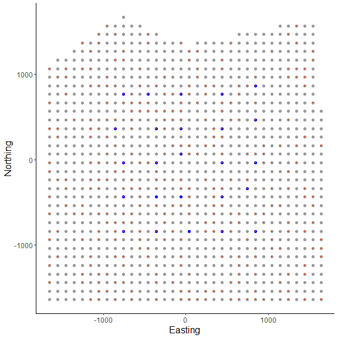
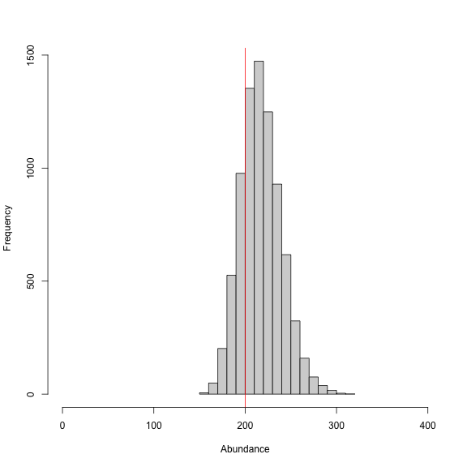
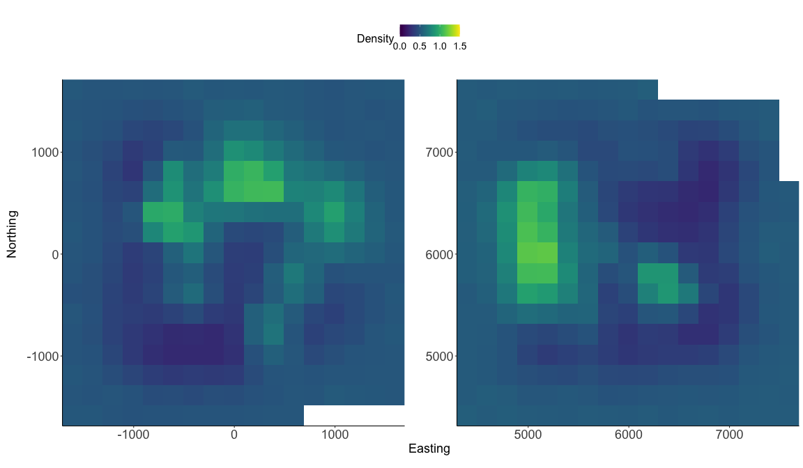

```{r, include = FALSE}
knitr::opts_chunk$set(
  collapse = TRUE,
  comment = "#>"
)
```

## Introduction

<p>
The forth vignette of the 'localSCR' package covers a set of 'discrete' Bayesian spatial capture-recapture (SCR) models (Royle et al. 2014). These inhomogenous point process models are designed to model SCR data for 'marked' or 'unmarked' individuals and model the spatial density of activity centers as a function of some environmental covariate, for instance. Although many distance detection functions are possible, the package currently includes only a bivariate normal model of space use, which is commonly employed in the literature. The package is meant to ease implementation of Bayesian SCR models using the 'nimble' package (de Valpine et a. 2022), which allows for increased flexibilty with the ability for the user to include custom functions and assign different algorithms to specific model parameters. I took advantage of this functionality with the goal of building a simple, straightforward workflow that was flexible enough to handle most mainstream SCR analysis problems. Visit <https://r-nimble.org/download> for information on installing 'nimble' and Rtools on your computer.
</p>
<br>

## Implementation

<p>
The 'localSCR' package implements Bayesian SCR models using the 'nimble' package (de Valpine et a. 2022) following methods described in Royle et al. (2014). We take advantage of recent developments in computation of SCR models. In this tutorial, two methods are implemented to decrease computational run time:

1) Using vectorized declarations for traps in distance function calculations
2) Separating the data augmentation process into two steps (Chandler 2018)

In some SCR problems, there are landscape features that create 'unsuitable' habitat for the study species. Habitat masks are used to account for these features and designate suitable (1) or unsuitable (0) habitat, and can be represented as a matrix or array of binary values. We follow the methods of Milleret et al. (2019) to implement the "ones" trick to account for habitat suitability. This restricts the possible locations of latent activity centers to only suitable habitat. The 'localSCR' package provides functions to construct a habitat mask from either raster or polygon data. In the discrete model, we'll use the habitat mask to limit the 'pixels' or 'cells' of our discrete state-space, such that only available cells will be sampled.

Finally, in some SCR designs, clusters of trap arrays may be spread out over the study area such that individuals can only be detected at one of multiple trap arrays (e.g., Furnas et al. 2018). This necessitates including the traps as a 3-dimensional array, using a site identifier to track which site a detected or augmented individual belongs to, and using a dynamic indexing in the model. 
</p>
<br>
<p>

## Functions used from 'localSCR' package:
* `get_discrete()` grabs template model for given inputs using the `nimbleCode()` function
* `grid_classic()` define state-space grid and extent 
* `initialize_classic()` generate starting locations for activity area centers
* `mask_polygon()` create habitat mask matrix or array from polygon
* `nimSummary()` summarize lists of Markov Chain Monte Carlo (MCMC) output
* `realized_density()` generate realized density surface from MCMC output
* `run_discrete()` wrapper function to run discrete models using 'nimble' package
* `sim_classic()` simulate basic spatial capture-recapture data
</p>
<br>

## Turtorial

This tutorial includes three parts:

1) Create 'classic' SCR data and convert to discretized format
2) Workflow for discrete SCR model for marked individuals using a 2D trap array, sex-specific scaling parameter and habitat mask
3) Workflow for discrete SCR model for marked individuals using a 3D trap array, sex-specific scaling parameter and habitat mask

</p>
<br>
<p>

```{r setup}
# load 'localSCR' package
library(localSCR)
```
<br>

### (1) Create 'classic' SCR data and convert to discretized format

```{r, fig.show='hide',eval=FALSE}
# simulate a single trap array with random positional noise
x <- seq(-800, 800, length.out = 5)
y <- seq(-800, 800, length.out = 5)
traps <- as.matrix(expand.grid(x = x, y = y))
set.seed(200)
traps <- traps + runif(prod(dim(traps)),-20,20) 

mysigma = c(300) # simulate sex-specific scaling parameter
mycrs = 32608 # EPSG for WGS 84 / UTM zone 8N
pixelWidth = 200 # store pixelWidth or grid resolution

# create state-space
Grid = grid_classic(X = traps, crs_ = mycrs, buff = 3*mysigma, 
                    res = pixelWidth)

# create polygon for mask
library(sf)
poly = st_sfc(st_polygon(x=list(matrix(c(-1765,-1765,1730,-1650,1600,
              1650,0,1350,-800,1700,-1850,1000,-1765,-1765)
            ,ncol=2, byrow=TRUE))), crs =  mycrs)

# create habitat mask
hab_mask = mask_polygon(poly = poly, grid = Grid$grid, crs_ = mycrs, 
prev_mask = NULL)

# Simulated abundance
Nsim = 200

# simulate data for uniform state-space and habitat mask
data3d = sim_classic(X = traps, ext = Grid$ext, crs_ = mycrs, 
                     sigma_ = mysigma,  prop_sex = 1, N = Nsim, K = 4, 
                     base_encounter = 0.15,enc_dist = "binomial",
                     hab_mask = hab_mask, setSeed = 200)

# total augmented population size 
M = 400

# get initial activity center starting values
s.st = initialize_classic(y=data3d$y, M=M, X=traps, ext = Grid$ext, 
                            hab_mask = hab_mask)

# convert traps and starting locations to discrete format
d_list = discretize_classic(X=traps, grid = Grid$grid, s.st = s.st, 
                            crs_ = mycrs, hab_mask = hab_mask)

# inspect discrete data list
str(d_list)
#> List of 4
#>  $ grid: num [1:270, 1:2] -808 -608 1592 -1208 -1008 ...
#>   ..- attr(*, "dimnames")=List of 2
#>   .. ..$ : NULL
#>   .. ..$ : chr [1:2] "x" "y"
#>  $ nPix: int 270
#>  $ X   : num [1:25, 1:2] -807.71 -407.71 -7.71 392.29 792.29 ...
#>   ..- attr(*, "dimnames")=List of 2
#>   .. ..$ : NULL
#>   .. ..$ : chr [1:2] "x" "y"
#>  $ s.st: int [1:400] 174 194 54 178 130 91 156 163 190 193 ...

# make ggplot of grid, and discretized trap locations 
# and starting activity center locations
library(ggplot2)
ggplot() + geom_point(data=as.data.frame(d_list$grid),aes(x=x,y=y),
                      color="grey60",size=2) + 
  geom_point(data=as.data.frame(d_list$X),aes(x=x,y=y),color="blue",size=3) +
    geom_point(data=as.data.frame(d_list$grid[d_list$s.st,]),
               aes(x=x,y=y),color="orangered",size=0.75) +
    theme_classic() + ylab("Northing") + xlab("Easting") +
    theme(axis.text = element_text(size=12),
          axis.title = element_text(size=16))
```

<p align="center" >
  
</p>

<p>
<br>
Here, we can see the state-space grid that was created after converting the state-space grid, traps, and initial activity centers using `discretize_classic()`. In the figure above, the state-space `grid` is reduced after applying a habitat mask (i.e., the number of rows was decreased) and is plotted with light gray points. Also, we can see that both the the traps `X` (shown as blue points) and initial activity centers `s.st` (shown as orange-red points) are discretized and overlap with the grid locations. We see that the function returns a list of revised grid based on the habitat mask `grid`, the number of available pixels `nPix`, the discretized trap locations `X`, and the grid indices for discretized initial activity center locations `s.st` as a vector.

In this example, We arbitrarily chose a grid resolution of 200 in this example (i.g., `res = 200`) to save model run time when creating the initial state-space using `grid_classic()`, but this will vary by problem. In situations involving habitat masks or discrete models, it is prudent to test the effect of different grid resolutions on the estimated abundance and density in SCR models (see Royle et al. 2014). Also, note the use to the EPSG code to define the coordinate reference system for our state-space (see <https://epsg.io/32608>). 

We also simulated some spatial capture-recapture data using `sim_classic()`. Above, we simulated a 'true' population size of 200 individuals (`N = 200`), 4 sampling occasions (`K = 4`), a single scaling parameter (`sigma_`) of 300 m, a baseline encounter probability of 0.15 (`base_encounter = 0.15`), the proportion of females (for example) (`prop_sex = 0.6`), a binomial encounter distribution (`enc_dist = "binomial"`) and we used our habitat mask (`hab_mask = hab_mask`). We also use `setSeed = 100` to make the simulation reproducible. We provide the function the extent of the state-space output from `grid_classic()` as `ext = Grid$ext`. Note that Grid is a list.

Next, we'll use these data components we created above in a discrete SCR model. The package includes a set of template discrete SCR models that we will use to run the simple example. Note that since we won't directly use `hab_mask` in the model, we won't include it as a data component. Rather, it is accounted for by deleting the coordinates in the `grid` that are unsuitable habitat (i.e., `hab_mask = 0`). Also, it would be easy to modify the model code if covariates were available to model density or the detection process.

</p>
<br>

### (2) Workflow for discrete SCR model for marked individuals using a 2D trap array, sex-specific scaling parameter and habitat mask

```{r, fig.show='hide',eval=FALSE}
# prepare data
data = list(y=data3d$y)
data$y = data$y[which(apply(data$y, 1, sum)!=0),,] # remove augmented records 
# covert to 2d by summing over individuals and traps
data$y = apply(data$y, c(1,2), sum) 

# add discretized traps
data$X = d_list$X/1000 # convert to km units

# add grid
data$grid = d_list$grid/1000 # convert to km units

# prepare constants (note that density is now in activity centers/km2 
# and each cell is now 0.01 km2 in area
constants = list(M = M,n0 = nrow(data$y),J=dim(data$y)[2], 
                 K=dim(data3d$y)[3],nPix=d_list$nPix,pixArea = (pixelWidth/1000)^2,
                 sigma_upper = 1, A = sum(hab_mask)*((pixelWidth/1000)^2))

# add z and zeros vector data for latent inclusion indicator
data$z = c(rep(1,constants$n0),rep(NA,constants$M - constants$n0))
data$zeros =  c(rep(NA,constants$n0),rep(0,constants$M - constants$n0))

# define all initial values 
inits = list(sigma = runif(1, 0.250, 0.350), s = d_list$s.st,
            alpha0 = 2.8, p0 = runif(1, 0.05, 0.15),
            z=c(rep(NA,constants$n0),rep(0,constants$M-constants$n0)))

# parameters to monitor
params = c("sigma","psi","p0","N","D","EN","alpha0","s","z")

# get model
discrete_model = get_discrete(type="marked",dim_y = 2, 
              enc_dist = "binomial",sex_sigma = FALSE,
              trapsClustered=FALSE)

# show model (not run)
# discrete_model

# run model (note this was run on a Mac with 16 GB 2667 MHz DDR4 
# and 2.3 GHz 8-Core Intel Core i9)
library(tictoc)
tic() # track time elapsed
out = run_discrete(model = discrete_model, data=data, constants=constants,
        inits=inits, params = params,niter = 5000, nburnin=1000, 
        thin=1, nchains=2, parallel=TRUE,  RNGseed = 500)
toc()
#> 1025.869 sec elapsed

# histogram of posterior samples for N (abundance)
samples = do.call(rbind, out)
par(mfrow=c(1,1))
hist(samples[,which(dimnames(out[[1]])[[2]]=="N")], xlab = "Abundance", 
     xlim = c(0,400), main="")
abline(v=Nsim, col="red") # add line for simulated abundance
```

<p align="center">
  
</p>
<br>
<p>

We note that the discrete model takes much longer to run compared to the continuous SCR model equivalent (i.e., 'classic' model). This results from using the categorical distribution to sample the pixels of our discrete state-space. In this example we have a somewhat fine grid at 200 m, which results 270 cells that the model has to consider for each individual in our augmented population size of `M = 400`. We also can't take advantage of the block sampling of activity center coordinates that greatly speeds up the classic model runs. 

We can see from the histogram of the posterior samples of `N` that our model estimates were close to the simulated value of 200 individuals (shown by red line) and were biased just slightly low at around 196 individuals. This is expected since this is only one realization of the detection process. In this example, we divided the pixelWidth by 1,000 in deriving the area (`A`) in our list of constants. This allowed us to estimate density in activity centers/km<sup>2</sup> rather than activity centers/m<sup>2</sup>. Note that care must be taken with any rescaling of the data or constants.

Next we use`nimSummary()` to quickly summarize the MCMC samples. Note that there are other options to summarize MCMC output, but this function is provided with the package and depends partly on the 'coda' package. Then, we make a realized density plot of the MCMC samples using `realized_density()`. In this function we make use of the list of grid and extent we created earlier called `Grid` as well as our saved coordinates reference system (`mycrs`). I'll also note that we need to use the argument `discrete = TRUE` to indicate that we need to transform the pixel indices saved for `s` into the state-space grid coordinates. The function will automate this for us. 

In this example, we also use the 'raster' package to make a simple plot of the realized density output. 
</p>
<br>
```{r, fig.show='hide',eval=FALSE}
# summarize MCMC samples (exclude parameters and don't plot)
nimSummary(out, exclude = c("s","z"), trace=FALSE)
#>        post.mean post.sd    q2.5     q50   q97.5 f0   n.eff  Rhat
#> D         18.222   1.768  15.093  18.148  21.944  1 314.957 1.006
#> EN       196.003  21.492 157.391 194.404 241.130  1 307.866 1.006
#> N        196.798  19.091 163.000 196.000 237.000  1 314.957 1.006
#> alpha0     2.893   0.110   2.679   2.890   3.106  1 316.798 1.006
#> p0         0.167   0.023   0.126   0.167   0.214  1 316.707 1.016
#> psi        0.490   0.054   0.393   0.486   0.603  1 307.866 1.006
#> sigma      0.310   0.021   0.274   0.308   0.358  1 201.439 1.043

# make realized density plot (we don't use the habitat mask here for 
# discrete model)
r = realized_density(samples = out, grid = d_list$grid, crs_ = mycrs, 
                     site = NULL, hab_mask = FALSE,discrete=TRUE)       
      
# load virdiis color palette and raster libraries      
library(viridis)
library(raster)

# make simple raster plot
plot(r, col=viridis(100),
     main=expression("Realized density (activity centers/0.2 km"^2*")"),
     ylab="Northing",xlab="Easting")
```


<p align="center">
  
</p>
<br>
<p>

Next we repeat a similar workflow but now we have two trap arrays that are clustered in space, and thus, there is a negligble chance of detecting an individual at more than one trap array. In this case, the functions in 'localSCR' can automatically detect that the traps are in a 3-dimensional format and we note that `sim_classic` will return a variable called `site` that identifies which trap array that each individual (both detected and not detected) belongs to. Note that the number of rows in the simulated data `y` will equal the simulated population size (here in the example, `N = 200`). However, because we are using a trick provided by Chandler (2018) to separate the data augmentation process into two steps, we only need the encounter data for those individuals that were detected in the model likelihood. Also, because we have no occasion-specific detection covariates, we can sum `y` over individuals and traps to result in a 2-dimensional encounter history array (i.e., `y[i,j]`). This speeds up the model under these conditions and we can specify this when we get the SCR model template by setting `y_dim = 2` in `get_classic(y_dim = 2,...)`. Otherwise, the workflow is very similar to having a 2-dimensional trap array in the previous example.

</p>
<br>

```{r, fig.show='hide',eval=FALSE}
# create an array of traps, as an approach where individuals will only be 
# detected at one of the trap arrays (e.g., Furnas et al. 2018)
Xarray = array(NA, dim=c(nrow(traps),2,2))
Xarray[,,1]=traps
Xarray[,,2]=traps+6000 # shift trapping grid to new locations

# create grid and extent for 3D trap array
GridX = grid_classic(X = Xarray, crs_ = mycrs, buff = 3*max(mysigma), 
                     res = pixelWidth)

# create polygon to use as a mask
library(sf)
poly = st_sfc(st_polygon(x=list(matrix(c(-1660,-1750,8730,-1050,7470,
7550,0,7950,-1800,8200,-1660,-1750),ncol=2, byrow=TRUE))), crs =  mycrs)

# make ggplot
g1=ggplot() + geom_point(data=as.data.frame(GridX$grid[,,1]),
                      aes(x=V1,y=V2),color="grey60",size=1.25) +
    geom_point(data=as.data.frame(Xarray[,,1]),
               aes(x=V1,y=V2),color="blue",size=2) +
    geom_point(data=as.data.frame(GridX$grid[,,2]),
               aes(x=V1,y=V2),color="grey60",size=1.25) +
    geom_point(data=as.data.frame(Xarray[,,2]),
               aes(x=V1,y=V2),color="blue",size=2) +
    geom_sf(data=poly, fill = NA) + coord_sf(datum=st_crs(mycrs)) +
    theme_classic() + ylab("Northing") + xlab("Easting") +
    scale_x_continuous(limits=c(-2000,9000)) +
    scale_y_continuous(limits=c(-2000,9000)) + 
    theme(axis.text = element_text(size=12),
               axis.title = element_text(size=16))
```

<p align="center">
  
</p>
<br>
<p>
In the figure we can see our two spatially separated trapping grids and that the polgon overlaps some of the gridded area. The area outside the polygon will be considered unsuitable when the habitat matrix is created. Note that the `site` variable will be only as long as the simulated population size (here, 300) and thus, we will need to augment the variable to have the length equal to the total augmented population size (i.e., `M = 600`). Otherwise the workflow is very similar to the previous one where we'll use `discretize_classic()` to convert our 'classic' SCR data to a discrete format. We'll use some of the items we created above in this example (e.g., `mysigma`,`mycrs`).
</p>
<br>
```{r, fig.show='hide',fig.width = 8,fig.height=14,eval=FALSE}
# get 3D habitat mask array for 3D grid
hab_mask = mask_polygon(poly = poly, grid = GridX$grid, crs_ = mycrs, 
prev_mask = NULL)

# simuated population size
Nsim = 300

# augmented population size
M=600

# simulate data for uniform state-space and habitat mask 
# (N is simulated abundance)
data4d = sim_classic(X = Xarray, ext = GridX$ext, crs_ = mycrs, 
                 sigma_ = mysigma, prop_sex = 1,N = Nsim, 
                 K = 4, base_encounter = 0.15, 
                 enc_dist = "binomial",hab_mask = hab_mask, 
                 setSeed = 300)

# augment site identifier
site = c(data4d$site,c(rep(1,((M-length(data4d$site))/2)),
                       rep(2,((M-length(data4d$site))/2))))

# get initial activity center starting values 
s.st = initialize_classic(y=data4d$y, M=M, X=Xarray, ext = GridX$ext, 
                            site = site, hab_mask = hab_mask)

# convert traps and starting locations to discrete format
d_list = discretize_classic(X=Xarray, grid = GridX$grid, s.st = s.st, 
                            crs_ = mycrs,site=site, hab_mask = hab_mask)

# inspect discrete data list
str(d_list)
#> List of 4
#>  $ grid: num [1:284, 1:2, 1:2] -1608 -1408 -1208 -1008 -808 ...
#>  $ nPix: int [1:2] 284 278
#>  $ X   : num [1:25, 1:2, 1:2] -807.71 -407.71 -7.71 392.29 792.29 ...
#>  $ s.st: num [1:600] 98 115 115 165 77 94 77 96 75 109 ...

# prepare data
data = list(y=data4d$y)
data$y = data$y[which(apply(data$y, 1, sum)!=0),,] # remove augmented records 
# covert to 2d by summing over individuals and traps
data$y = apply(data$y, c(1,2), sum) 

# add discretized traps
data$X = d_list$X #/1000 # convert to km units

# add grid
data$grid = d_list$grid #/1000 # convert to km units

# prepare constants (note that density is now in activity centers/km2 
# and each cell is now 0.02 km2 in area
constants = list(M = M,n0 = nrow(data$y),J=dim(data$y)[2],site=site,
                 K=dim(data4d$y)[3],nPix=sum(d_list$nPix),
                 pixArea = (pixelWidth^2),
                 sigma_upper = 1000, 
                 A = (sum(hab_mask)*((pixelWidth/1000)^2)),
                 nSites = dim(d_list$X)[3])

constants$npixSite = matrix(c(1,d_list$nPix[1],
                              d_list$nPix[1]+1,
                              sum(d_list$nPix)),
                            ncol=2,byrow=TRUE)

# add z and zeros vector data for latent inclusion indicator
data$z = c(rep(1,constants$n0),rep(NA,constants$M - constants$n0))
data$zeros =  c(rep(NA,constants$n0),rep(0,constants$M - constants$n0))

# define all initial values 
inits = list(sigma = runif(1, 250, 350), s = d_list$s.st,
            alpha0 = -11.25, p0 = runif(dim(d_list$X)[3], 0.05, 0.15),
            z=c(rep(NA,constants$n0),rep(0,constants$M-constants$n0)))

# parameters to monitor
params = c("sigma","psi","p0","N","D","EN","alpha0","s","z")

# get model
discrete_model = get_discrete(type="marked",dim_y = 2, 
              enc_dist = "binomial",sex_sigma = FALSE,
              trapsClustered=TRUE)

# show model (not run)
# discrete_model

# run model (note this was run on a Mac with 16 GB 2667 MHz DDR4 
# and 2.3 GHz 8-Core Intel Core i9)
library(tictoc)
tic() # track time elapsed
out = run_discrete(model = discrete_model, data=data, constants=constants,
        inits=inits, params = params,niter = 5000, nburnin=1000, 
        thin=1, nchains=2, parallel=TRUE,  RNGseed = 500)
toc()
#> 1612.656 sec elapsed

# histogram of posterior samples for N (abundance)
samples = do.call(rbind, out)
par(mfrow=c(1,1))
hist(samples[,which(dimnames(out[[1]])[[2]]=="EN")], xlab = "Expected abundance", 
     xlim = c(0,600), main="")
abline(v=Nsim, col="red") # add line for simulated abundance
```

<p align="center">
  
</p>
<br>


<br>
<p>
We might run a few more iterations to have everything nicely converged, but we won't do that here given that it took about 20 minutes to run the model. We'll use`nimSummary()` to quickly summarize the MCMC samples and check convergence. 

We again make a realized density surface and note that the `realized_density()` function outputs a list of length 2 in this example since we have 2 spatially separated trapping grids here that are in a 3-dimensional array format. I'll again note that we need to use the argument `discrete = TRUE` to indicate that we need to transform the pixel indices saved for `s` into the state-space grid coordinates. The function will automate this for us. We'll need to provide the extent `ext = GridX$ext` since we have a 3-dimensional trapping array. 
</p>
<br>

```{r, fig.show='hide',eval=FALSE}
# summary table of MCMC output (exclude "s" and "z" parameters)
nimSummary(out, exclude = c("s","z"))
#>        post.mean post.sd    q2.5     q50   q97.5 f0   n.eff  Rhat
#> D         13.131   1.397  10.676  12.989  16.192  1 175.165 1.011
#> EN       294.564  33.831 232.157 291.304 367.164  1 178.972 1.011
#> N        295.180  31.395 240.000 292.000 364.000  1 175.165 1.011
#> alpha0   -11.249   0.114 -11.481 -11.254 -11.022  0 188.347 1.013
#> p0[1]      0.148   0.025   0.104   0.147   0.199  1 294.255 1.033
#> p0[2]      0.128   0.023   0.088   0.127   0.179  1 324.642 1.032
#> psi        0.491   0.056   0.387   0.486   0.612  1 178.972 1.011
#> sigma    287.695  23.052 250.820 284.677 339.804  1 139.887 1.103

# generate realized density surface
r = realized_density(samples=out, grid=d_list$grid, ext = GridX$ext,
            crs_=mycrs,site=constants$site, discrete=TRUE)

# load needed packages for multiplot
library(viridis) 
library(grid)
library(cowplot)
library(ggpubr) 
library(rasterVis)

# plot raster from site 1
p1<-gplot(r[[1]]) + geom_raster(aes(fill = value)) +
          scale_fill_viridis(na.value = NA, name="Density",
          limits=c(0,1.5),breaks=seq(0,1.5,by=0.5)) +
          xlab("") + ylab("") + theme_classic() +
          scale_x_continuous(expand=c(0, 0)) + 
          scale_y_continuous(expand=c(0, 0)) + 
           theme(axis.text = element_text(size=18))

# plot raster from site 2
p2<-gplot(r[[2]]) + geom_raster(aes(fill = value)) +
          scale_fill_viridis(na.value = NA, name="Density",
          limits=c(0,1.5),breaks=seq(0,1.5,by=0.5)) +
          xlab("") + ylab("") + theme_classic() + 
          scale_x_continuous(expand=c(0, 0)) + 
          scale_y_continuous(expand=c(0, 0)) + 
          theme(axis.text = element_text(size=18))

# arrange the two plots in a single row
prow <- plot_grid(p1 + theme(legend.position="none"),
           p2 + theme(legend.position="none"),
           align = 'vh',
           labels = NULL,
           hjust = -1,
           nrow = 1
           )

# extract the legend from one of the plots
legend_t <- get_legend(p1 + theme(legend.position = "top",
                        legend.direction = "horizontal",
                        legend.text = element_text(size=14),
                        legend.title = element_text(size=16)))

# add the legend above the row we made earlier. Give it 20% of the height
# of one plot (via rel_heights).
pcomb <- plot_grid(legend_t, prow, ncol = 1, rel_heights = c(.2, 1))

# add x and y axis labels
pcomb <-annotate_figure(pcomb, bottom = textGrob("Easting", 
              gp=gpar(fontsize=18), vjust = -1, hjust = 0),
              left = textGrob("Northing", rot=90, gp=gpar(fontsize=18),
              vjust = 1, hjust = 0.5))
pcomb
```

<p align="center">
  
</p>
<br>
<p>

That's it for the discrete models! You've made it through the fourth 'localSCR' tutorial. Please see Royle et al. (2014) for more details about SCR theory and modeling. The next tutorials will focus on applying localapproaches to 'classic' and discrete SCR models. We'll see that significant reductions in computational run time can occur with local approaches depending on the problem, but especially for discrete SCR models where we deal with relatively slow run time when there are many pixels to sample from. 

</p>
<br>

## References

Chandler, R. B. 2018. Speeding up data augmentation in BUGS.
<https://groups.google.com/forum/#!topic/hmecology/o6cWDqHHgOE>.

de Valpine P, C. Paciorek, D. Turek, N. Michaud, C. Anderson-Bergman, F. Obermeyer, C. C. Wehrhahn, A. Rodrìguez, L. D. Temple, and S. Paganin. 2022. _NIMBLE: MCMC, Particle
Filtering, and Programmable Hierarchical Modeling_. doi: 10.5281/zenodo.1211190 (URL: <https://doi.org/10.5281/zenodo.1211190>), R package version 0.12.2, URL: <https://cran.r-project.org/package=nimble>.

Furnas, B. J., R. H. Landers, S. Hill, S. S. Itoga, and B. N. Sacks. 2018. Integrated modeling to estimate population size and composition of mule deer. Journal of Wildlife Management 82:1429–1441. 

Milleret, C., P. Dupont, C. Bonenfant, H. Henrik Brøseth, Ø. Flagstad,
C. Sutherland, and R. Bischof. 2019. A local evaluation of the individual
state‐space to scale up Bayesian spatial capture‐recapture. Ecology and
Evolution 9:352–363.

Royle, J. A., R. B. Chandler, R. Sollmann, and B. Gardner. 2014. Spatial
capture‐recapture. Academic Press, Waltham, Massachusetts, USA.
