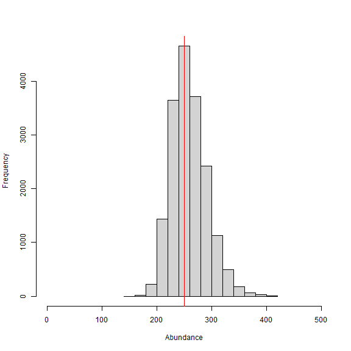

```{r, include = FALSE}
knitr::opts_chunk$set(
  collapse = TRUE,
  comment = "#>"
)
```

## Introduction

<p>
The fifth vignette of the 'localSCR' package expands what I define as a set of 'classic' Bayesian spatial capture-recapture (SCR) models (Royle et al. 2014) to allow for local evaluation of the state-space (see Milleret et al. 2019). As we'll see, this adds another layer of complexity, but the 'localSCR' package provides data processing function to ease this approach. These models are designed to model SCR data for 'marked' or 'unmarked' individuals under the assumption of uniformly distributed activity centers (i.e,. a continuous state-space). Although many distance detection functions are possible, the package currently includes only a bivariate normal model of space use, which is commonly employed in the literature. The package is meant to ease implementation of Bayesian SCR models using the 'nimble' package (de Valpine et a. 2022), which allows for increased flexibility with the ability for the user to include custom functions and assign different algorithms to specific model parameters. I took advantage of this functionality with the goal of building a simple, straightforward workflow that was flexible enough to handle most mainstream SCR analysis problems. Visit <https://r-nimble.org/download> for information on installing 'nimble' and Rtools on your computer.
</p>
<br>

## Implementation

<p>
The 'localSCR' package implements Bayesian SCR models using the 'nimble' package (de Valpine et a. 2022) following methods described in Royle et al. (2014). We take advantage of recent developments in computation of SCR models. In this tutorial, four methods are implemented to decrease computational run time:

1) Block updating of x and y activity center coordinates (Turek et al. 2021)
2) Using vectorized declarations for traps in distance function calculations
3) Separating the data augmentation process into two steps (Chandler 2018)
4) Local evaluation of the state-space (Milleret et al. 2019)

In some SCR problems, there are landscape features that create 'unsuitable' habitat for the study species. Habitat masks are used to account for these features and designate suitable (1) or unsuitable (0) habitat, and can be represented as a matrix or array of binary values. We follow the methods of Milleret et al. (2019) to implement the "ones" trick to account for habitat suitability. This restricts the possible locations of latent activity centers to only suitable habitat. The 'localSCR' package provides functions to construct a habitat mask from either raster or polygon data. 

Finally, in some SCR designs, clusters of trap arrays may be spread out over the study area such that individuals can only be detected at one of multiple trap arrays (e.g., Furnas et al. 2018). This necessitates including the traps as a 3-dimensional array, using a site identifier to track which site a detected or augmented individual belongs to, and using a dynamic indexing in the model. 
</p>
<br>
<p>

## Functions used from 'localSCR' package:
* `customize_model()` delete and/or append lines from model code
* `get_classic()` grabs template model for given inputs using the `nimbleCode()` function
* `grid_classic()` define state-space grid and extent 
* `initialize_classic()` generate starting locations for activity area centers
* `localize_classic()` prepare classic data componets for local approach
* `mask_polygon()` create habitat mask matrix or array from polygon
* `nimSummary()` summarize lists of Markov Chain Monte Carlo (MCMC) output
* `realized_density()` generate realized density surface from MCMC output
* `rescale_local()` rescale inputs to prepare data for using habitat mask
* `run_classic()` wrapper function to run classic models using 'nimble' package
* `sim_classic()` simulate basic spatial capture-recapture data
</p>
<br>

## Turtorial

This tutorial includes three parts:

1) Create 'classic' SCR data and convert to localized format
2) Workflow for local SCR model for marked individuals using a 2D trap array, single scaling parameter and habitat mask
3) Workflow for local SCR model for marked individuals using a 3D trap array, single scaling parameter and habitat mask
</p>
<br>
<p>

```{r setup}
# load 'localSCR' package
library(localSCR)
```
<br>


### (1) Create 'classic' SCR data and convert to localized format

```{r, fig.show='hide',eval=FALSE}
# simulate a single trap array with random positional noise
x <- seq(-1600, 1600, length.out = 6)
y <- seq(-1600, 1600, length.out = 6)
traps <- as.matrix(expand.grid(x = x, y = y))
# add some random noise to locations
set.seed(100)
traps <- traps + runif(prod(dim(traps)),-20,20) 
mysigma = 300 # simulate sigma of 300 m
mycrs = 32608 # EPSG for WGS 84 / UTM zone 8N
pixelWidth = 100 # grid resolution

# Simulated abundance
Nsim = 250

# manually create state-space grid and extent (note that I ran the code through
# the localize_classic() using the same settings as other vignettes for 
# grid_classic() without using a habitat mask to get the extent
# for the scaled-up state-space grid)

# make raster layer of grid
r_grid = raster::raster(xmn=-2698.706,xmx=2701.294,ymn=-2700.908,ymx=2699.092,
                        res = pixelWidth, crs = mycrs)
Grid = list() # create Grid list
Grid$grid = raster::coordinates(r_grid)
Grid$ext = raster::extent(r_grid)

# create polygon to use as a mask
library(sf)
poly = st_sfc(st_polygon(x=list(matrix(c(-2465,-2465,2530,-2550,2650,2550,
0,2550,-800,2500,-2350,2300,-2465,-2465),ncol=2, byrow=TRUE))), crs =  mycrs)

# make simple plot
par(mfrow=c(1,1))
plot(Grid$grid, pch=20, col="gray60")
points(traps, col="blue",pch=20)
plot(poly, add=TRUE)
```

<p align="center" >
  
</p>


<p>
<br>
Here, we can see the state-space grid that was created from `grid_classic()`. Also, the traps (or detectors) are plotted over top in blue. We arbitrarily chose a grid resolution of 100 in this example (i.g., `res = 100`), but this will vary by problem. In situations involving habitat masks or discrete models, it is prudent to test the effect of different grid resolutions on the estimated abundance and density in SCR models (see Royle et al. 2014). Also, note the use to the EPSG code to define the coordinate reference system for our state-space (see <https://epsg.io/32608>). 

Now lets simulate some spatial capture-recapture data using `sim_classic()`. Note for this example, we will simulate a 'true' population size of 200 individuals (`N = 200`), 4 sampling occasions (`K = 4`), a scaling parameter (`sigma_`) of 300 m, a baseline encounter probability of 0.15 (`base_encounter = 0.15`), no sex-specificity (`prop_sex = 1`), and no habitat mask (`hab_mask = FALSE`). We also use `setSeed = 100` to make the simulation reproducible. We provide the function the extent of the state-space output from `grid_classic()` as `ext = Grid$ext`. Note that Grid is a list.

Also, we'll need the function `localize_classic()` that will convert our 'classic' data components to a format that can be used in the local evaluation approach. This function will do the heavy lifting and takes under a minute depending upon that data set and computer as there are some spatial operations that must occur to build the individual state-space grids and then scale up to the study-area level state-space. 

We'll first create a habitat mask and simulate some SCR data, and then covert it to local format.

</p>
<br>


```{r, fig.show='hide',eval=FALSE}
# create habitat mask from polygon
hab_mask = mask_polygon(poly = poly, grid = Grid$grid, crs_ = mycrs, 
prev_mask = NULL)

# simulate SCR data
data3d = sim_classic(X = traps, ext = Grid$ext, crs_ = mycrs, sigma_ = mysigma, 
                  prop_sex = 1, N = Nsim, K = 4, base_encounter = 0.15, 
                  enc_dist = "binomial", hab_mask = hab_mask, setSeed = 100)

# augmented population size (detected + augmented individuals)
M=500

# generate initial activity center coordinates for 2D trap array without 
# habitat mask
s.st = initialize_classic(y=data3d$y, M=M, X=traps, ext = Grid$ext, 
hab_mask = hab_mask)

# now use grid_classic to create an individual-level state-space (with origin 0, 0)
Grid_ind = grid_classic(X = matrix(c(0,0),nrow=1), crs_ = mycrs, buff = 3*mysigma, res = 100)

# now localize the data components created above (a bit time consuming ~ 20 sec)
# set layers to equal to evenly augment state-space
library(tictoc)
tic()
local_list = localize_classic(y = data3d$y, grid_ind = Grid_ind$grid, X=traps, 
                            crs_ = mycrs, sigma_ = mysigma, s.st = s.st,
                            hab_mask = hab_mask)
toc()
#> 40.25 sec elapsed

# inspect local_list
str(local_list)
#> List of 8
#>  $ y           : int [1:99, 1:36, 1:4] 0 0 0 0 0 0 0 0 0 0 ...
#>  $ X           : num [1:500, 1:36, 1:2] -1608 -965 -970 965 -1588 ...
#>  $ grid        : num [1:2916, 1:2] -2649 -2549 -2449 -2349 -2249 ...
#>   ..- attr(*, "dimnames")=List of 2
#>   .. ..$ : NULL
#>   .. ..$ : chr [1:2] "x" "y"
#>  $ prop_habitat: num [1:500] 1 1 1 1 0.981 ...
#>  $ ext_mat     : num [1:500, 1:4] -573 -1226 -572 716 -1843 ...
#>  $ ext         :Formal class 'Extent' [package "raster"] with 4 slots
#>   .. ..@ xmin: num -2699
#>   .. ..@ xmax: num 2701
#>   .. ..@ ymin: num -2701
#>   .. ..@ ymax: num 2699
#>  $ Jind        : num [1:500] 35 26 35 19 24 24 24 26 35 25 ...
#>  $ s.st        : num [1:500, 1:2] 327 -326 328 1616 -943 ...
```


<p>
<br>

Here, we can see the data components created from `localize_classic()` that we will use in the next step to fit the localized version of a 'classic' SCR models. Specifically, we can see that many data components now have a dimension for the individual. For instance, we can see that our traps (`X`) now has 500 rows, one for each individual. This allows individuals to be exposed to traps that are within 9 x sigma from the center of their activity coordinates. The activity center is estimated as the average trap location for marked individuals and the center of the augmented individual state-spaces for 'augmented' individuals. Also, we'll see that the object `ext_mat` contains individual-specific extents that restrict the possible individual activity center locations based on the object `Grid_ind$grid` that we created for the individual state-space grid. Finally, we track the number of traps that each individual is exposed to using the object `Jind` (see the help for the function by entering `?localize_classic` into the console. 

</p>
<br>

### (2) Workflow for local SCR model for marked individuals using a 2D trap array, single scaling parameter and habitat mask

<p>
<br>

Next, we will use the converted data list above to carry out our local SCR model workflow. We'll use the `rescale_local()` function to rescale our data components since we are using a habitat mask; otherwise, this would not be necessary. We'll also convert our 3D encounter data to a 2D version since we do not have any occasion-specific variables to explain detection probability; thus, we do not need to loop over the occasions and model run time is reduced. We'll want to account for the proportion of habitat (`prop.habitat` in our data list) that is suitable for each individual's state-space grid (Milleret et al. 2019. Finally, as a last step before we initiate the model, we'll use `customize_model()` to add some specific model code that we need for the local approach. Rather than build another function to define templates for local models, we choose to just modify our other 'classic' and discrete models and make it easy to add code. This code could also be copied and pasted and then manually edited as well.  

</p>
<br>


```{r, fig.show='hide',eval=FALSE}
# rescale inputs
rescale_list = rescale_local(X = local_list$X, ext = local_list$ext, 
                             ext_mat = local_list$ext_mat,
                             s.st = local_list$s.st, hab_mask = hab_mask)

# prepare encounter data data
data = list(y=local_list$y)
data$y = apply(data$y, c(1,2), sum) # covert to 2d by summing over individuals and traps

# add rescaled traps
data$X = rescale_list$X

# prepare constants (rescale area to activity centers/km 2)
constants = list(M = M,n0 = nrow(data$y),Jind = local_list$Jind, K = 4,
                 xy_bounds = rescale_list$ext_mat, sigma_upper = 1000, 
                 pixelWidth=pixelWidth,
                 A = prod(c(abs(diff(local_list$ext[1:2]))/1000,
                            abs(diff(local_list$ext[3:4]))/1000)))

# add z and zeros vector data for latent inclusion indicator
data$z = c(rep(1,constants$n0),rep(NA,constants$M - constants$n0))
data$zeros =  c(rep(NA,constants$n0),rep(0,constants$M - constants$n0))

# add hab_mask,OK for habitat check, and proportion of available habitat
data$hab_mask = hab_mask
data$OK = rep(1,constants$M)
data$prop.habitat = local_list$prop_habitat

# define all initial values
inits = list(sigma = runif(1, 250, 350), s = rescale_list$s.st,psi=runif(1,0.2,0.3),
          p0 = runif(1, 0.05, 0.15), z=c(rep(NA,constants$n0),rep(0,constants$M-constants$n0)),
          pOK=data$OK)

# parameters to monitor
params = c("sigma","psi","p0","N","D","s","z")

# get model
scr_model = get_classic(dim_y = 2, enc_dist = "binomial",sex_sigma = FALSE,
hab_mask=TRUE,trapsClustered = FALSE)

# show lines of model to help with editing
print_model(scr_model)

# add code to inject localization lines
add_model = nimble::nimbleCode({
  z[i] ~ dbern(psim[i])                                                         
  psim[i] <- (1 - (1 - psi)^prop.habitat[i]) 
  s[i,1] ~ dunif(xy_bounds[i,1], xy_bounds[i,2])
  s[i,2] ~ dunif(xy_bounds[i,3], xy_bounds[i,4])
  dist[i, 1:Jind[i]] <- sqrt((s[i,1] - X[i,1:Jind[i],1])^2 + (s[i, 2] - X[i,1:Jind[i], 2])^2)
  p[i,1:Jind[i]] <- p0 * exp(-dist[i, 1:Jind[i]]^2/(2 * sigma.pixel^2))
  for (i in 1:n0) {                                                          
     for (j in 1:Jind[i]) {                                                       
         y[i, j] ~ dbin(p[i, j], K)                                         
     }                                                                      
  }                                                                          
  for (i in (n0 + 1):M) {                                                    
     zeros[i] ~ dbern((1 - prod(1 - p[i, 1:Jind[i]])^K) * z[i])                   
  } 
})

# edit model (injecting two new lines on line 7, otherwise 1-1 line replacement)
local_model = customize_model(model = scr_model,append_code = add_model,
                              remove_line = c(7,8:9,12:13,15:22), 
                              append_line = c(7,7,8:9,12:13,15:22))

# run model
library(tictoc)
tic() # track time elapsed
out = run_classic(model = local_model, data=data, constants=constants, 
      inits=inits, params = params, niter = 10000, nburnin=1000, 
      thin=1, nchains=2, parallel=TRUE, RNGseed = 500)
toc()
#> 125.08 sec elapsed

# summarize output
samples = do.call(rbind, out)
par(mfrow=c(1,1))
hist(samples[,which(dimnames(out[[1]])[[2]]=="N")], xlab = "Abundance", xlim = c(0,500), main="")
abline(v=Nsim, col="red") # add line for simulated abundance
```


<p align="center">
  
</p>
<br>
<p>

With this particular problem, we don't see much of a gain in run time. In fact, the model seems to take slightly longer to run compared to not using the local approach. This is due to the scale of the problem since our traps are not spaced out that far from each other and there aren't that many augmented individuals. Upon inspecting the vector `constants$Jind`, we see that most individuals are exposed to about 24/36 (~67%) of the traps still. Given that our state-space was not that larger relative to the simulated animal activity areas (i.e., `sigma = 300 m`), we really don't gain that much with this approach. However, we'll see in the discrete tutorial that we'll save a lot of time by applying the approach outlined in Woodruff et al. (2020), especially when the number of state-space pixels in large.

We can also see from the histogram of the posterior samples of `N` that our model estimates were very close to the simulated value of 250 individuals (shown by red line) at around 260 individuals. This is expected since this is only one realization of the detection process. In this example, we divided the pixelWidth by 1,000 in deriving the area (`A`) in our list of constants. This allowed us to estimate density in activity centers/km<sup>2</sup> rather than activity centers/m<sup>2</sup>. Note that care must be taken with any rescaling of the data or constants.

Next we use`nimSummary()` to quickly summarize the MCMC samples and check for convergence. Note that there are other options to summarize MCMC output, but this function is provided with the package and depends partly on the 'coda' package. Then, we make a realized density plot of the MCMC samples using `realized_density()`. In this function we make use of the list of grid and extent we created earlier called `Grid` as well as our saved coordinates reference system (`mycrs`). In this example, we use the 'raster' package to make a simple plot of the output. We can see that the habitat mask has resulted in some cells having `NA` values where the habitat was unsuitable.
</p>
<br>


```{r, fig.show='hide',eval=FALSE}
# summarize MCMC samples (exclude parameters and don't plot)
nimSummary(out, exclude = c("s","z"), trace=FALSE)
#>       post.mean post.sd    q2.5     q50   q97.5 f0   n.eff  Rhat
#> D         8.901   1.099   7.064   8.779  11.351  1 346.433 1.013
#> N       259.560  32.057 206.000 256.000 331.000  1 346.433 1.013
#> p0        0.194   0.039   0.127   0.191   0.280  1 361.349 1.014
#> psi       0.567   0.069   0.446   0.561   0.716  1 330.496 1.014
#> sigma   272.652  22.015 233.584 271.202 322.137  1 294.354 1.004

# make realized density plot 
r = realized_density(samples = out, grid = local_list$grid, 
                     crs_ = mycrs, hab_mask = hab_mask)      
      
# load virdiis color palette and raster libraries      
library(viridis)
library(raster)

# make simple raster plot
plot(r, col=viridis(100),
     main=expression("Realized density (activity centers/100 m"^2*")"),
     ylab="Northing",xlab="Easting")
```

<p align="center">
  
</p>
<br>

<p>
Next we repeat a similar workflow but now we have two trap arrays that are clustered in space, and thus, there is a negligble chance of detecting an individual at more than one trap array. In this case, the functions in 'localSCR' can automatically detect that the traps are in a 3-dimensional format and we note that `sim_classic()` will return a variable called `site` that identifies which trap array that each individual (both detected and not detected) belongs to. Note that the number of rows in the simulated data `y` will equal the simulated population size (here in the example, `N = 200`). However, because we are using a trick provided by Chandler (2018) to separate the data augmentation process into two steps, we only need the encounter data for those individuals that were detected in the model likelihood. Also, because we have no occasion-specific detection covariates, we can sum `y` over individuals and traps to result in a 2-dimensional encounter history array (i.e., `y[i,j]`). This speeds up the model under these conditions and we can specify this when we get the SCR model template by setting `y_dim = 2` in `get_classic(y_dim = 2,...)`. Otherwise, the workflow is very similar to having a 2-dimensional trap array in the previous example.
</p>
<br>

### (3) Workflow for local SCR model for marked individuals using a 3D trap array, single scaling parameter and habitat mask


```{r, fig.show='hide',eval=FALSE}
# simulate a single trap array with random positional noise
x <- seq(-1600, 1600, length.out = 6)
y <- seq(-1600, 1600, length.out = 6)
traps <- as.matrix(expand.grid(x = x, y = y))
# add some random noise to locations
set.seed(100)
traps <- traps + runif(prod(dim(traps)),-20,20) 
mysigma = 300 # simulate sigma of 300 m
mycrs = 32608 # EPSG for WGS 84 / UTM zone 8N
pixelWidth = 100 # grid resolution

# Simulated abundance
Nsim = 400

# create an array of traps, as an approach where individuals will only be detected 
# at one of the trap arrays (e.g., Furnas et al. 2018)
Xarray = array(NA, dim=c(nrow(traps),2,2))
Xarray[,,1]=traps
Xarray[,,2]=traps+10000 # shift trapping grid to new locations

# create grid and extent for 3D trap array
GridX = grid_classic(X = Xarray, crs_ = mycrs, buff = 3*max(mysigma), res = 100)

# create polygon to use as a mask
library(sf)
poly = st_sfc(st_polygon(x=list(matrix(c(-2160,-2900,14430,-1550,12270,
12400,0,13050,-2800,13100,-2160,-2900),ncol=2, byrow=TRUE))), crs =  mycrs)

# make a simple plot
plot(Xarray[,,1],xlim=c(-3000,16000),ylim=c(-3000,16000),
     xlab="Easting",ylab="Northing")
points(GridX$grid[,,2],col="gray60",pch=20)
points(GridX$grid[,,1],col="gray60",pch=20)
points(Xarray[,,1],pch=20,col="blue")
points(Xarray[,,2],pch=20,col="blue")
plot(poly, add=TRUE)
```

<p align="center">
  
</p>
<br>

In the figure we can see our two spatially separated trapping grids and that the polgon overlaps some of the gridded area. The area outside the polygon will be considered unsuitable when the habitat matrix is created. Note that the `site` variable will be only as long as the simulated population size (here, 400) and thus, we will need to augment the variable to have the length equal to the total augmented population size (i.e., `M = 800`). Otherwise the workflow is very similar to the previous one and we'll just run it through without examining all the steps.


```{r, fig.show='hide',eval=FALSE}
# get 3D habitat mask array for 3D grid
hab_mask = mask_polygon(poly = poly, grid = GridX$grid, crs_ = mycrs, 
prev_mask = NULL)

# simulate data for uniform state-space and habitat mask (N is simulated abundance)
data4d = sim_classic(X = Xarray, ext = GridX$ext, crs_ = mycrs, sigma_ = mysigma, 
                prop_sex = 1,N = Nsim, K = 4, base_encounter = 0.15, 
                enc_dist = "binomial",hab_mask = hab_mask, setSeed = 500)

M=800

# augment site identifier
site = c(data4d$site,c(rep(1,((M-length(data4d$site))/2)),
                       rep(2,((M-length(data4d$site))/2))))

# get initial activity center starting values 
s.st = initialize_classic(y=data4d$y, M=M, X=Xarray, ext=GridX$ext, 
                            site = site, hab_mask = hab_mask)

# now use grid_classic to create an individual-level state-space (with origin 0, 0)
Grid_ind = grid_classic(X = matrix(c(0,0),nrow=1), crs_ = mycrs, buff = 3*mysigma, res = 100)

# now localize the data components created above (a bit time consuming ~ 40 sec)
# set layers to equal to evenly augment state-space
library(tictoc)
tic()
local_list = localize_classic(y = data4d$y, grid_ind = Grid_ind$grid, X=Xarray, 
                            crs_ = mycrs, sigma_ = mysigma, s.st = s.st,
                            site = site,hab_mask = hab_mask)
toc()

# inspect local list
str(local_list)
#> List of 8
#>  $ y           : int [1:150, 1:36, 1:4] 0 0 0 0 0 0 0 0 0 0 ...
#>  $ X           : num [1:800, 1:36, 1:2] 965 -970 959 -1608 -1588 ...
#>  $ grid        : num [1:2916, 1:2, 1:2] -2649 -2549 -2449 -2349 -2249 ...
#>  $ prop_habitat: num [1:800] 1 1 1 1 1 ...
#>  $ ext_mat     : num [1:800, 1:4] 716 707 691 -593 -1843 ...
#>  $ ext         :List of 2
#>   ..$ :Formal class 'Extent' [package "raster"] with 4 slots
#>   .. .. ..@ xmin: num -2699
#>   .. .. ..@ xmax: num 2701
#>   .. .. ..@ ymin: num -2701
#>   .. .. ..@ ymax: num 2699
#>   ..$ :Formal class 'Extent' [package "raster"] with 4 slots
#>   .. .. ..@ xmin: num 7301
#>   .. .. ..@ xmax: num 12701
#>   .. .. ..@ ymin: num 7299
#>   .. .. ..@ ymax: num 12699
#>  $ Jind        : num [1:800] 19 21 24 32 24 26 30 25 29 24 ...
#>  $ s.st        : num [1:800, 1:2] 1616 1607 1591 307 -943 ...

# rescale inputs
rescale_list = rescale_local(X = local_list$X, ext = local_list$ext, ext_mat = local_list$ext_mat,
                             s.st = local_list$s.st, site = site, hab_mask = hab_mask)

# prepare encounter data data
data = list(y=local_list$y)
data$y = apply(data$y, c(1,2), sum) # covert to 2d by summing over individuals and traps

# add rescaled traps
data$X = rescale_list$X

# prepare constants (rescale area to activity centers/km 2)
constants = list(M = M,n0 = nrow(data$y),Jind = local_list$Jind, K = 4,
                 xy_bounds = rescale_list$ext_mat, sigma_upper = 1000, 
                 pixelWidth=pixelWidth,
                 A = (sum(hab_mask)*(pixelWidth/1000)^2),
                 nSites=dim(Xarray)[3],site = site)

# add z and zeros vector data for latent inclusion indicator
data$z = c(rep(1,constants$n0),rep(NA,constants$M - constants$n0))
data$zeros =  c(rep(NA,constants$n0),rep(0,constants$M - constants$n0))

# add hab_mask,OK for habitat check, and proportion of available habitat
data$hab_mask = hab_mask
data$OK = rep(1,constants$M)
data$prop.habitat = local_list$prop_habitat

# define all initial values
inits = list(sigma = runif(1, 250, 350), s = rescale_list$s.st,psi=runif(1,0.2,0.3),
          p0 = runif(constants$nSites, 0.05, 0.15),
          z=c(rep(NA,constants$n0),rep(0,constants$M-constants$n0)),
          pOK=data$OK)

# parameters to monitor
params = c("sigma","psi","p0","N","D","s","z")

# get model
scr_model = get_classic(dim_y = 2, enc_dist = "binomial",sex_sigma = FALSE,
hab_mask=TRUE,trapsClustered = TRUE)

# show lines of model to help with editing
print_model(scr_model)

# create code to inject localization lines
add_model = nimble::nimbleCode({
  psim[i] <- (1 - (1 - psi)^prop.habitat[i])
  s[i,1] ~ dunif(xy_bounds[i,1], xy_bounds[i,2])
  s[i,2] ~ dunif(xy_bounds[i,3], xy_bounds[i,4])
  dist[i, 1:Jind[i]] <- sqrt((s[i,1] - X[i,1:Jind[i],1])^2 + (s[i, 2] - X[i,1:Jind[i], 2])^2)
  p[i,1:Jind[i]] <- p0[site[i]] * exp(-dist[i, 1:Jind[i]]^2/(2 * sigma.pixel^2))
  for (i in 1:n0) {                                                          
     for (j in 1:Jind[i]) {                                                       
         y[i, j] ~ dbin(p[i, j], K)                                         
     }                                                                      
  }                                                                          
  for (i in (n0 + 1):M) {                                                    
     zeros[i] ~ dbern((1 - prod(1 - p[i, 1:Jind[i]])^K) * z[i])                   
  } 
})

# edit model (a straight 1-1 line replacement here)
local_model = customize_model(model = scr_model,append_code = add_model,
                              remove_line = c(10:12,15:16,18:25), 
                              append_line = c(10:12,15:16,18:25))

# run model
library(tictoc)
tic() # track time elapsed
out = run_classic(model = local_model, data=data, constants=constants, 
      inits=inits, params = params, niter = 10000, nburnin=1000, 
      thin=1, nchains=2, parallel=TRUE, RNGseed = 500)
toc()
#> 237.82 sec elapsed

# summarize MCMC output
nimSummary(out, exclude = c("s","z"))
#>       post.mean post.sd    q2.5     q50   q97.5 f0   n.eff  Rhat
#> D         8.754   0.823   7.314   8.694  10.527  1 361.800 1.004
#> N       424.939  39.928 355.000 422.000 511.000  1 361.800 1.004
#> p0[1]     0.167   0.029   0.116   0.165   0.230  1 476.028 1.010
#> p0[2]     0.176   0.030   0.126   0.174   0.242  1 514.860 1.013
#> psi       0.540   0.053   0.447   0.537   0.650  1 348.219 1.004
#> sigma   276.489  16.936 244.493 276.152 310.937  1 328.285 1.010

# plot posterior abundance with line for simulated abundance
samples = do.call(rbind, out)
par(mfrow=c(1,1))
hist(samples[,which(dimnames(out[[1]])[[2]]=="N")], xlab = "Abundance",
     xlim = c(0,900), main="")
abline(v=Nsim, col="red") # add line for simulated abundance
```


<p align="center">
  
</p>
<br>
<p>
We can see that again, our estimated abundance is pretty close to the simulated value (red line) and biased high by only about 25 individuals. However, the model finishes in about 4 minutes despite having an augmented population size of 800 individuals.

We again make a realized density surface and note that the `realized_density()` function outputs a list of length 2 in this example since we have 2 spatially separated trapping grids here that are in a 3-dimensional array format. We'll need to provide the extent `ext = local_list$ext` since we have a 3-dimensional trapping array. 
</p>
<br>


```{r, fig.show='hide',eval=FALSE}
# make realized density plot (must trace "s" and "z" above)
r = realized_density(samples=out, grid=local_list$grid, ext = local_list$ext, 
                  crs_=mycrs, site=constants$site, hab_mask=hab_mask)

# load needed packages for multiplot
library(viridis) 
library(grid)
library(cowplot)
library(ggpubr) 
library(rasterVis)

# plot raster from site 1
p1<-gplot(r[[1]]) + geom_raster(aes(fill = value)) +
          scale_fill_viridis(na.value = NA, name="Density",
          limits=c(0,0.3),breaks=seq(0,0.3,by=0.1)) +
          xlab("") + ylab("") + theme_classic() +
          scale_x_continuous(expand=c(0, 0)) + 
          scale_y_continuous(expand=c(0, 0)) + 
           theme(axis.text = element_text(size=18))

# plot raster from site 2
p2<-gplot(r[[2]]) + geom_raster(aes(fill = value)) +
          scale_fill_viridis(na.value = NA, name="Density",
          limits=c(0,0.3),breaks=seq(0,0.3,by=0.1)) +
          xlab("") + ylab("") + theme_classic() + 
          scale_x_continuous(expand=c(0, 0)) + 
          scale_y_continuous(expand=c(0, 0)) + 
          theme(axis.text = element_text(size=18))

# arrange the two plots in a single row
prow <- plot_grid(p1 + theme(legend.position="none"),
           p2 + theme(legend.position="none"),
           align = 'vh',
           labels = NULL,
           hjust = -1,
           nrow = 1
           )

# extract the legend from one of the plots
legend_t <- get_legend(p1 + theme(legend.position = "top",
                        legend.direction = "horizontal",
                        legend.text = element_text(size=14),
                        legend.title = element_text(size=16)))

# add the legend above the row we made earlier. Give it 20% of the height
# of one plot (via rel_heights).
pcomb <- plot_grid(legend_t, prow, ncol = 1, rel_heights = c(.2, 1))

# add x and y axis labels
pcomb <-annotate_figure(pcomb, bottom = textGrob("Easting", 
              gp=gpar(fontsize=18), vjust = -1, hjust = 0),
              left = textGrob("Northing", rot=90, gp=gpar(fontsize=18),
              vjust = 1, hjust = 0.5))
pcomb
```


<p align="center">
  
</p>
<br>


<p>
Congrats! You've made it through the fifth 'localSCR' tutorial. Please see Royle et al. (2014) for more details about SCR theory and modeling. The next tutorial will be similar but focused on applying the local approach to a discrete SCR model.
</p>
<br>

## References

Chandler, R. B. 2018. Speeding up data augmentation in BUGS.
<https://groups.google.com/forum/#!topic/hmecology/o6cWDqHHgOE>.

de Valpine P, C. Paciorek, D. Turek, N. Michaud, C. Anderson-Bergman, F. Obermeyer, C. C. Wehrhahn, A. Rodrìguez, L. D. Temple, and S. Paganin. 2022. _NIMBLE: MCMC, Particle
Filtering, and Programmable Hierarchical Modeling_. doi: 10.5281/zenodo.1211190 (URL: <https://doi.org/10.5281/zenodo.1211190>), R package version 0.12.2, URL: <https://cran.r-project.org/package=nimble>.

Furnas, B. J., R. H. Landers, S. Hill, S. S. Itoga, and B. N. Sacks. 2018. Integrated modeling to estimate population size and composition of mule deer. Journal of Wildlife Management 82:1429–1441. 

Milleret, C., P. Dupont, C. Bonenfant, H. Henrik Brøseth, Ø. Flagstad,
C. Sutherland, and R. Bischof. 2019. A local evaluation of the individual
state‐space to scale up Bayesian spatial capture‐recapture. Ecology and
Evolution 9:352–363.

Turek, D., C. Milleret, T. Ergon, and H. Brøseth 2021. Efficient estimation of large‐scale spatial capture–recapture model. Ecosphere <DOI:10.1002/ecs2.338>5.

Royle, J. A., R. B. Chandler, R. Sollmann, and B. Gardner. 2014. Spatial
capture‐recapture. Academic Press, Waltham, Massachusetts, USA.

Woodruff, S., D. R. Eacker, and L. Waits. 2020. Estimating coyote density in local, discrete  Bayesian capture-recapture models. Journal of Wildlife Management 10.1002/jwmg.21967.