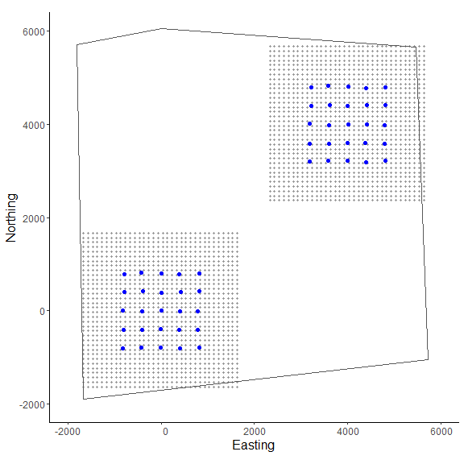

```{r, include = FALSE}
knitr::opts_chunk$set(
  collapse = TRUE,
  comment = "#>"
)
```


## Introduction


<p>
The second vignette of the 'localSCR' package builds on 'classic' Bayesian spatial capture-recapture (SCR) models to introduce the spatial count model (Royle et al. 2014). The data consist of counts of unmarked individuals where individual identity is not possible. These models are designed to model SCR data for 'marked' or 'unmarked' individuals under the assumption of uniformly distributed activity centers (i.e,. a continuous state-space). Although many distance detection functions are possible, the package currently includes only a bivariate normal model of space use, which is commonly employed in the literature. The package is meant to ease implementation of Bayesian SCR models using the 'nimble' package (de Valpine et a. 2022), which allows for increased flexibilty with the ability for the user to include custom functions and assign different algorithms to specific model parameters. I took advantage of this functionality with the goal of building a simple, straightforward workflow that was flexible enough to handle most mainstream SCR analysis problems. Visit <https://r-nimble.org/download> for information on installing 'nimble' and Rtools on your computer.
</p>
<br>


## Implementation


<p>
The 'localSCR' package implements Bayesian spatial count models using the 'nimble' package (de Valpine et a. 2022) following methods described in Royle et al. (2014). We take advantage of recent developments in computation of SCR models. In this tutorial, two methods are implemented to decrease computational run time:

1) Block updating of x and y activity center coordinates (Turek et al. 2021)
2) Using vectorized declarations for traps in distance function calculations

In some SCR problems, there are landscape features that create 'unsuitable' habitat for the study species. Habitat masks are used to account for these features and designate suitable (1) or unsuitable (0) habitat, and can be represented as a matrix or array of binary values. We follow the methods of Milleret et al. (2019) to implement the "ones" trick to account for habitat suitability. This restricts the possible locations of latent activity centers to only suitable habitat. The 'localSCR' package provides functions to construct a habitat mask from either raster or polygon data. 

Finally, in some SCR designs, clusters of trap arrays may be spread out over the study area such that individuals can only be detected at one of multiple trap arrays (e.g., Furnas et al. 2018). This necessitates including the traps as a 3-dimensional array, using a site identifier to track which site a detected or augmented individual belongs to, and using a dynamic indexing in the model. 
</p>
<br>
<p>


## Turtorial


This tutorial includes four parts:
1) Create traps (or detectors) and then construct a state-space
2) Simulate 'classic' SCR data and covert to spatial count data  
3) Workflow for 2-D trap array including habitat mask
4) Adding prior information on the scaling and encounter rate parameters
5) Workflow for 3-D trap array including  habitat mask
</p>
<br>

<p>


## Functions used from 'localSCR' package:
* `customize_model()` delete and/or append lines from model code
* `get_unmarked()` grabs spatial count model for given inputs using the `nimbleCode()` function
* `grid_classic()` define state-space grid and extent 
* `initialize_classic()` generate starting locations for activity area centers
* `mask_polygon()` create habitat mask matrix or array from polygon
* `nimSummary()` summarize lists of Markov Chain Monte Carlo (MCMC) output
* `realized_density()` generate realized density surface from MCMC output
* `rescale_classic()` rescale inputs to prepare data for using habitat mask
* `run_classic()` wrapper function to run classic models using 'nimble' package
* `sim_classic()` simulate basic spatial capture-recapture data
</p>
<br>


```{r setup}
# load 'localSCR' package
library(localSCR)
```
<br>


### (1) Simulate a single trap array with random positional noise and create state-space


```{r, fig.show='hide'}
# simulate a single trap array with random positional noise
x <- seq(-800, 800, length.out = 5)
y <- seq(-800, 800, length.out = 5)
traps <- as.matrix(expand.grid(x = x, y = y))
traps <- traps + runif(prod(dim(traps)),-20,20) 

mysigma = 300 # simulate sigma of 300 m
mycrs = 32608 # EPSG for WGS 84 / UTM zone 8N

# create state-space
Grid = grid_classic(X = traps, crs_ = mycrs, buff = 3*mysigma, res = 100)

# make ggplot of grid and trap locations
library(ggplot2)
ggplot() + geom_point(data=as.data.frame(Grid$grid),aes(x=x,y=y),color="grey60",
                      size=1.25) + 
    geom_point(data=as.data.frame(traps),aes(x=x,y=y),color="blue",size=2) +
    theme_classic() + ylab("Northing") + xlab("Easting") +
    scale_x_continuous(expand=c(-0.1, 0.1)) + 
    scale_y_continuous(expand=c(-0.1, 0.1)) + 
    theme(axis.text = element_text(size=12),axis.title = element_text(size=16))
```

<p align="center" >
  
</p>
<br>
<p>
Here, we use the same approach as in the first vignette in creating the state-space from `grid_classic()`. Again, the traps (or detectors) are plotted over top of the grid in blue. We arbitrarily chose a grid resolution of 100 in this example (i.g., `res = 100`), but this will vary by problem. In most situations, it is prudent to test the effect of different grid resolutions on the estimated abundance and density in SCR models (see Royle et al. 2014). Also, note the use to the EPSG code to define the coordinate reference system for our state-space (see <https://epsg.io/32608>). 

Now lets first simulate some spatial capture-recapture data using `sim_classic()`. Importantly, we use `enc_dist = "poisson"` to select the Poisson distribution to simulate counts rather than binary data. We will use this simulated data to produce our spatial count data of unmarked individuals. Note for this example, we will simulate a 'true' population size of 200 individuals (`N = 200`), 4 sampling occasions (`K = 4`), a scaling parameter (`sigma_`) of 300 m, a baseline encounter probability of 0.10 (`base_encounter = 0.10`), no sex-specificity (`prop_sex = 1`), and no habitat mask (`hab_mask = FALSE`). We also use `setSeed = 100` to make the simulation reproducible. Again, we provide the function the extent of the state-space output from `grid_classic()` as `ext = Grid$ext`. Note that Grid is a list.
</p>
<br>


### (2) Simulate SCR data and convert it to spatial count data.


```{r, fig.show='hide'}
# simulate SCR data
data3d = sim_classic(X = traps, ext = Grid$ext, crs_ = mycrs, 
                     sigma_ = mysigma, prop_sex = 1,N = 200, K = 4,
                     base_encounter = 0.10, enc_dist = "poisson", 
                     hab_mask = FALSE, setSeed = 100)

# inspect simulated data
str(data3d)

# We sum over traps and occasions to produce a 2-dimensional spatial count data set
n = apply(data3d$y, c(2,3), sum)

# inspect n[j,k]
str(n)
```

<p>
We can see the data were transformed from a 3-dimensional array (`y[i,j,k]`) to a 2-dimensional array (`n[j,k]`) by summing over individuals. In the spatial count model, we cannot identify individuals but we can observe a count of unmarked individuals at each occasion and trap (Royle et al. 2014). In general, this model depends on spatial autocorrelation in the observations to estimate model parameters. We'll see how the estimates compare to a problem with marked individuals that was presented in the first vignette by running an analogous spatial count modeling problem . We'll use the same trap array but set a single scaling parameter (`sigma_`) of 300 m.

We add on an additional layer of complexity by introducing a habitat mask. After constructing a polygon feature using the 'sf' package, we then use the function `mask_polygon()` to build a habitat mask as a matrix object. The habitat matrix is either '0' (unsuitable) or '1' (suitable). In the habitat matrix the rows represent the y-coordinate ("Northing") of the state-space grid and the columns represent the x-coordinate ("Easting") of the state-space grid. We'll use this habitat matrix as data below in this part of the tutorial.

We also see the use of `initialize_classic()`, which generates plausible starting activity center locations for all individuals. Note that because all individuals are unmarked here, we'll use the `all_random = TRUE` argument in `initialize_classic()` to generate all random locations to initalize the activity center coordinates. Given our simulated population size of 200, we specify the total augmented population size (all augmented individuals) at 400 (`M = 400`).
</p>
<br>


### (3) Workflow for simple spatial count model with Poisson encounter distribution and habitat mask


<br>
```{r, fig.show='hide'}
# simulate a dense, spatially autocorrelated trap array with random positional noise
x <- seq(-800, 800, length.out = 5)
y <- seq(-800, 800, length.out = 5)
traps <- as.matrix(expand.grid(x = x, y = y))
traps <- traps + runif(prod(dim(traps)),-20,20) # add some random noise to locations

mysigma = 300 # simulate a single scaling parameter
mycrs = 32608 # EPSG for WGS 84 / UTM zone 8N
pixelWidth = 100 # store pixelWidth or grid resolution

# create state-space grid and extent
Grid = grid_classic(X = traps, crs_ = mycrs, buff = 3*max(mysigma), res = pixelWidth) 

# create polygon for mask
library(sf)
poly = st_sfc(st_polygon(x=list(matrix(c(-1765,-1765,1730,-1650,1600,1650,0,1350,-800,1700,
-1850,1000,-1765,-1765),ncol=2, byrow=TRUE))), crs =  mycrs)

# create habitat mask
hab_mask = mask_polygon(poly = poly, grid = Grid$grid, crs_ = mycrs, 
                        prev_mask = NULL)

# simulate data for uniform state-space and habitat mask
data3d = sim_classic(X = traps, ext = Grid$ext, crs_ = mycrs, 
            sigma_ = mysigma, prop_sex = 1,N = 200, K = 4, 
            base_encounter = 0.3, enc_dist = "poisson",
            hab_mask = hab_mask, setSeed = 100)


# total augmented population size 
M = 500

# get initial activity center starting values
s.st3d = initialize_classic(y=NULL, M=M, X=traps, buff = 3*max(mysigma), 
                            hab_mask = hab_mask, all_random=TRUE)
  
# make ggplot
ggplot() + geom_point(data=as.data.frame(Grid$grid),aes(x=x,y=y),color="grey60",
                      size=1.25) + 
    geom_point(data=as.data.frame(traps),aes(x=x,y=y),color="blue",size=3) +
    geom_point(data=as.data.frame(s.st3d),aes(x=V1,y=V2),color = "orangered",size=2.5,alpha=0.5) +
    geom_sf(data=poly, fill = NA) + coord_sf(datum=st_crs(mycrs)) +
    theme_classic() + ylab("Northing") + xlab("Easting") +
    scale_x_continuous(expand=c(0.025, 0.025)) + 
    scale_y_continuous(expand=c(0.025, 0.025)) + 
    theme(axis.text = element_text(size=12),axis.title = element_text(size=16))
```

<p align="center">
  
</p>
<br>
<p>
In the figure above we can see the effect of the polygon in creating a habitat mask for the state-space. The `initialize_classic()` function contains the initial activity center locations to within the polygon (note that those points on the edges were in suitable habitat when the continuous location were discretized and checked with the habitat mask). 

We now have most of the components we will need to analyze the simulated data set. However, because we are using a habitat mask in the model (`hab_mask`), we must rescale the traps, grid extent, and initial activity center locations. To run the spatial count model using the template model from `get_unmarked()`, we'll need to change the paramter names `"s"` and `"z"` to `"su"` and `"zu"` in `params` to denote that these are unmarked individuals. We also set the `s_alias = "su"` argument in `run_classic()`. This allows the block updating of x- and y- activity center coordinates to function properly. Additionally, we have the `zu` parameter initialized with `rbinom` rather than separating the data augmentation as in vignette 1 with the marked individuals. 

Because the model uses the Poisson encounter distribution, we also need to intialize the encounter rate `lam0` rather than the encounter probability `p0` as in the binomial likelihood. We also need to add `lam0` to `params` and `lam0_upper` to `constants` given the default uniform distribution used in the model (i.e., `lam0 ~ dunif(0, lam0_upper)`). 

</p>
<br>


```{r, fig.show='hide'}
# rescale inputs
rescale_list = rescale_classic(X = traps, ext = Grid$ext, s.st = s.st3d, 
                               hab_mask = hab_mask)

# store rescaled extent
ext = rescale_list$ext

# Prepare data by summing over traps and occasions and add to list
data = list(n = apply(data3d$y, c(2,3), sum))

# add rescaled traps
data$X = rescale_list$X

# prepare constants (note get density in activity center/100 m2 rather than activity centers/m2)
constants = list(M = M,J=dim(data3d$y)[2], K=dim(data3d$y)[3],
x_lower = ext[1], x_upper = ext[2], y_lower = ext[3], y_upper = ext[4],
lam0_upper = 1,sigma_upper = 1000, 
A = (sum(hab_mask)*(pixelWidth/100)^2),pixelWidth=pixelWidth)

# add hab_mask and OK for habitat check
data$hab_mask = hab_mask
data$OK = rep(1,constants$M)

# get initial activity center starting values
s.st = rescale_list$s.st

# define all initial values
inits = list(sigma = runif(1, 250, 350), su = s.st,psi=runif(1,0.4,0.6),
lam0 = runif(1, 0.05, 0.15),pOK=data$OK,zu=rbinom(constants$M,1,0.5))

# parameters to monitor
params = c("sigma","psi","lam0","N","D","su","zu")

# get spatial count model
sc_model = get_unmarked(occ_specific = FALSE,
                         hab_mask=TRUE,trapsClustered=FALSE)

# run model (note we set s_alias to "su" for spatial count model)
library(tictoc)
tic() # track time elapsed
out = run_classic(model = sc_model, data=data, constants=constants,
inits=inits, params = params,niter = 10000, nburnin=1000, thin=1, nchains=2, parallel=TRUE,
RNGseed = 500, s_alias="su")
toc()

# summarize output
samples = do.call(rbind, out)

par(mfrow=c(1,1))
hist(samples[,which(dimnames(out[[1]])[[2]]=="N")], xlab = "Abundance", xlim = c(0,500), main="")
abline(v=200, col="red") # add line for simulated abundance
```

<p align="center">
  
</p>
<br>
<p>
Besides taking longer to run, we can see from the histogram of the posterior samples of `N` that convergence is somewhat poor. This is not surprising given that the model is asking so much of the data in trying to estimate the number of individuals from observing a count of unmarked individuals for a given occasion and trap. We could try increasing the number of iterations, but this is likely futile since there simply is not enough information. We have some other options that we'll explore in the next part of the tutorial. 

In this example, we divided the pixelWidth by 100 in deriving the area (`A`) in our list of constants. This allowed us to estimate density in activity centers/100 m<sup>2</sup> rather than activity centers/m<sup>2</sup>. Note that care must be taken with any rescaling of the data or constants.

Next we use`nimSummary()` to quickly summarize the MCMC samples. Note that there are other options to summarize MCMC output, but this function is provided with the package and depends partly on the 'coda' package.
</p>
<br>

```{r, fig.show='hide'}
# summarize MCMC samples (exclude parameters and don't plot)
nimSummary(out, exclude_params = c("su","zu"), trace=FALSE)

```

<br>
<p>
Although we are able to produce estimates, they are not reliable due to the lack of convergence and huge uncertainty. This will be the case for many spatial count modeling problems and thus, it is common to include prior information or combine marked and unmarked individuals into a spatial mark-resight analysis (the topic of vignette 3). Here, we'll test out the effect of bringing in prior information on the scaling parameter; this could occur if we had estimates of `sigma` from a previous study or another data source.We'll first need to use a moment matching function (e.g., normal to gamma moments) from the 'modeltools' package (add citation) called `estGammaParam()`. The gamma distribution is appropriate since it has support from 0 to infinity. For this example, we'll just grab some estimates of posterior standard error from part 3 of vignette 1. We know the 'true' simulated value of sigma is 300. 
<br>


### (4) Adding prior information on the scaling and encounter rate parameters


<br>
```{r, fig.show='hide'}

# get from Github and load
#install_github("austinnam/modeltools",force=TRUE) 
library(modeltools)

# get 'alpha' and 'beta' parameters of Gamma distribution
gparam = estGammaParam(mu = mysigma, sigma = 30)

# view prior distribution for sigma (scaling parameter)
hist(rgamma(100000,shape=gparam$alpha,rate=1/gparam$beta),main="",xlab="Gamma prior")
```

<p align="center">
  
</p>
<br>

To add our prior information, we'll use `customize_model()` to edit our previously created model. Then, we'll rerun the model using `run_classic`. 

<br>

```{r, fig.show='hide'}
# define new code to replace line 3 in 'sc_model'
library(nimble)
new_prior = nimbleCode({
   sigma ~ dgamma(alpha, 1/beta) # note that dgamma takes rate (1/beta)
})

# delete old prior on line 3 and replace with new prior 
sc_model_inf = customize_model(model = sc_model, append_code = new_prior,
                               line_append=3,line_remove=3)

# inspect model (not run)
# sc_model_inf

# add 'alpha' and 'beta' to list of constants
constants$alpha = gparam$alpha
constants$beta = gparam$beta

# run model (note we set s_alias to "su" for spatial count model)
library(tictoc)
tic() # track time elapsed
out = run_classic(model = sc_model_inf, data=data, constants=constants,
inits=inits, params = params,niter = 10000, nburnin=1000, thin=1, nchains=2, parallel=TRUE,
RNGseed = 500,s_alias="su")
toc()

# summarize output
samples = do.call(rbind, out)
par(mfrow=c(1,1))
hist(samples[,which(dimnames(out[[1]])[[2]]=="N")], xlab = "Abundance", xlim = c(0,500), main="")
abline(v=200, col="red") # add line for simulated abundance
```

<p align="center">
  
</p>
<br>


Again, we see that convergence is not great despite having prior information on sigma, but it's an improvement and the median estimate of N is close to the simulated value of 200. The uncertainty both the encounter rate `lam0` and the augmentation parameter `psi` is still huge, which translates into large uncertainty in abundance. We can try adding prior information about the encounter rate as well and see how this affects the estimates. We'll use a similar strategy as we did for the scaling parameter 'sigma'. 


<br>
```{r, fig.show='hide',fig.width = 8,fig.height=14}
# define new code to replace line 3 in 'sc_model'
new_prior = nimbleCode({
   lam0 ~ dgamma(alpha_lam0, 1/beta_lam0) # note that dgamma takes rate (1/beta)
})

# delete old prior on line 3 and replace with new prior 
sc_model_inf2 = customize_model(model = sc_model_inf, append_code = new_prior,
                               line_append=2,line_remove=2)

# inspect model (not run)
# sc_model_inf2

# get 'alpha' and 'beta' parameters of Gamma distribution
lam0_param = estGammaParam(mu = 0.30, sigma = 0.03)

# add 'alpha' and 'beta' to list of constants
constants$alpha_lam0 = lam0_param$alpha
constants$beta_lam0 = lam0_param$beta

# run model (note we set s_alias to "su" for spatial count model)
library(tictoc)
tic() # track time elapsed
out = run_classic(model = sc_model_inf2, data=data, constants=constants,
inits=inits, params = params,niter = 10000, nburnin=1000, thin=1, nchains=2, parallel=TRUE,
RNGseed = 500,s_alias="su")
toc()

# summarize output (exclude "su" and "zu" from table and make posterior/trace plots)

nimSummary(out, exclude_params = c("su","zu"), trace=TRUE, plot_all=FALSE)
```

<p align="center">
  
</p>
<br>
<p>
We can see that convergence is improved by a decent margin with the addition of prior information but a considerable amount of uncertainty still exists in abundance `N` which has around a 26.0% (61.8/237.9*100) coefficient of variation (CV). The estimate of abundance is about 238 individuals, which is biased slightly highly high. Regardless, this example shows that without prior information (or sharing of parameters with other data sources such as in a mark-resight approach), the spatial count model struggles to make inference to abundance on its own. We also note a substantial increase in model run time  up to 20 minutes on our machine (albeit on a somewhat slow laptop).

Finally, we make a realized density plot of the MCMC samples using `realized_density()`. In this function we make use of the list of grid and extent we created earlier called `Grid` as well as our saved coordinates reference system (`mycrs`). In this example, we use the 'raster' package to make a simple plot of the output. We can see that the habitat mask has resulted in some cells having `NA` values where the habitat was unsuitable.
</p>
<br>


```{r, fig.show='hide'}
# make realized density plot (need to specify s_alias and z_alias)
r = realized_density(samples = out, grid = Grid$grid, crs_ = mycrs, site = NULL, 
                     hab_mask = hab_mask, s_alias = "su", z_alias = "zu")       
      
# load virdiis color palette and raster libraries      
library(viridis)
library(raster)

# make simple raster plot
plot(r, col=viridis(100),
     main=expression("Realized density (activity centers/100 m"^2*")"),
     ylab="Northing",xlab="Easting")
```


<p align="center">
  
</p>
<br>


We demonstrated the ability of functions such as `customize_model()` to efficiently edit model code without have to copy and paste a large amount of text. We used 'sim_classic()' to first generate a 3-dimensional encounter history data set for marked individuals, and then we summed over traps and occasions to arrive at a spatial count data set (`n[j,k]`). 

As a final step example in this tutorial, we demonstrate the ability of the 'localSCR' package to aid in analyzing a spatial count model when we have clustered trap arrays (i.e., trap arrays that are spaced out far enough that individuals can only be detected on one array). The workflow will be similar to part 3 in our example, except that we'll need to create an indexing to allocate augmented individuals to the correct trap array. For this, we'll create the objects `site_indexL` and `site_indexU` and we will see this index in the model as `site_indexL[g]:site_indexU[g]`. We'll also use the same informative priors the we developed above in part 4. 

</p>


### (5) 


<br>
```{r, fig.show='hide'}
# simulate a single trap array with random positional noise
x <- seq(-800, 800, length.out = 5)
y <- seq(-800, 800, length.out = 5)
traps <- as.matrix(expand.grid(x = x, y = y))
traps <- traps + runif(prod(dim(traps)),-20,20) 

mysigma = 300 # simulate single scaling parameter
mycrs = 32608 # EPSG for WGS 84 / UTM zone 8N
pixelWidth = 100 # store pixelWidth

# create an array of traps, as an approach where individuals will only be detected 
# at one of the trap arrays (e.g., Furnas et al. 2018)
Xarray = array(NA, dim=c(nrow(traps),2,2))
Xarray[,,1]=traps
Xarray[,,2]=traps+4000 # shift trapping grid to new locations

# create grid and extent for 3D trap array
GridX = grid_classic(X = Xarray, crs_ = mycrs, buff = 3*max(mysigma), res = 100)

# create polygon to use as a mask
library(sf)
poly = st_sfc(st_polygon(x=list(matrix(c(-1660,-1900,5730,-1050,5470,
5650,0,6050,-1800,5700,-1660,-1900),ncol=2, byrow=TRUE))), crs =  mycrs)

# make ggplot
ggplot() + geom_point(data=as.data.frame(GridX$grid[,,1]),aes(x=V1,y=V2),
                      color="grey60",size=1.25) +
    geom_point(data=as.data.frame(Xarray[,,1]),aes(x=V1,y=V2),color="blue",size=2) +
    geom_point(data=as.data.frame(GridX$grid[,,2]),aes(x=V1,y=V2),color="grey60",
               size=1.25) +
    geom_point(data=as.data.frame(Xarray[,,2]),aes(x=V1,y=V2),color="blue",size=2) +
    geom_sf(data=poly, fill = NA) + coord_sf(datum=st_crs(mycrs)) +
    theme_classic() + ylab("Northing") + xlab("Easting") +
    scale_x_continuous(limits=c(-2000,6000)) +
    scale_y_continuous(limits=c(-2000,6000)) + 
    theme(axis.text = element_text(size=12),axis.title = element_text(size=16))
```

<p align="center">
  
</p>
<br>
<p>
In the figure we can see our two spatially separated trapping grids and that the polgon overlaps some of the gridded area. The area outside the polygon will be considered unsuitable when the habitat matrix is created. Note that the `site` variable will be only as long as the simulated population size (here, 200) and thus, we will need to augment the variable to have the length equal to the total augmented population size (i.e., `M = 400`). Otherwise the workflow is very similar to the previous one. 
</p>
<br>

```{r, fig.show='hide',fig.width = 8,fig.height=14}
# get 3D habitat mask array for 3D grid
hab_mask = mask_polygon(poly = poly, grid = GridX$grid, crs_ = mycrs, prev_mask = NULL)

# simulate data for uniform state-space and habitat mask (N is simulated abundance)
data4d = sim_classic(X = Xarray, ext = GridX$ext, crs_ = mycrs, sigma_ = mysigma, 
                   prop_sex = 1,N = 200, K = 4, base_encounter = 0.3, 
                   enc_dist = "poisson",hab_mask = hab_mask, setSeed = 100)

# organize by site and bind into an array
library(abind) # load abind package
y = abind(data4d$y[which(data4d$site==1),,],data4d$y[which(data4d$site==2),,], along = 4)

# total augmented population size 
M = 400

# augment site identifier
site = c(rep(1,200),rep(2,200))

# get initial activity center starting values 
s.st4d = initialize_classic(y=NULL, M=M, X=Xarray, buff = 3*max(mysigma), 
                      site = site, hab_mask = hab_mask,all_random = TRUE)

# rescale inputs
rescale_list = rescale_classic(X = Xarray, ext = GridX$ext, s.st = s.st4d, 
                               site = site, hab_mask = hab_mask)

# store rescaled extent and convert to matrix
ext = do.call(rbind, lapply(rescale_list$ext, as.vector))

# Prepare data by summing over traps and occasions and add to list
data = list(n = apply(y, c(2,3,4), sum),x_lower = ext[,1],x_upper = ext[,2],
            y_lower = ext[,3],y_upper = ext[,4],X = rescale_list$X)

# add hab_mask, proportion of available habitat, and OK for habitat check
data$hab_mask = hab_mask
# need to adjust proportion of habitat available
data$prop.habitat=apply(hab_mask,3,mean) 
data$OK = rep(1,constants$M)

# prepare constants (note get density in activity center/100 m2)
constants = list(M = M,J=dim(data4d$y)[2],
 K=dim(data4d$y)[3], sigma_upper = 1000, A = (sum(hab_mask)*(pixelWidth/100)^2),
pixelWidth=pixelWidth,nSites=dim(Xarray)[3],site = site)

# add indexes for sites and individuals
constants$site_indexL = seq(1,M,200)
constants$site_indexU = seq(200,M,200)
          
# priors for sigma: 'alpha' and 'beta' 
constants$alpha = gparam$alpha
constants$beta = gparam$beta

# priors for lam0: 'alpha' and 'beta' 
constants$alpha_lam0 = lam0_param$alpha
constants$beta_lam0 = lam0_param$beta

# get initial activity center starting values
s.st = rescale_list$s.st

# define all initial values
inits = list(sigma = runif(1, 250, 350), su = s.st,psi=runif(1,0.4,0.6),
lam0 = runif(1, 0.1, 0.3),pOK=data$OK,zu=rbinom(constants$M,1,0.5))

# get initial activity center starting values
s.st = rescale_list$s.st

# define all initial values
inits = list(sigma = runif(1, 250, 350), su = s.st, psi=runif(1,0.2,0.3),
lam0 = runif(dim(data$X)[3], 0.1, 0.2),
pOK=data$OK,z=rbinom(M,1,0.5))

# parameters to monitor
params = c("sigma","psi","lam0","N","D","su","zu")

# get model
sc_model = get_unmarked(occ_specific = FALSE, hab_mask = TRUE, 
                        trapsClustered = TRUE)

# model code to replace old code
add_model = nimbleCode({
  lam0[g] ~ dgamma(alpha_lam0,1/beta_lam0)
  sigma ~ dgamma(alpha, 1/beta)
})

# now create new model
sc_model_inf = customize_model(sc_model, add_model, line_append = c(3,4),
                               line_remove = c(3,5))

# inspect model (not run)
# sc_model_inf

# run model (need to set s_alias)
library(tictoc)
tic() # track time elapsed
out = run_classic(model = sc_model_inf, data=data, constants=constants,
inits=inits, params = params,niter = 10000, nburnin=1000, thin=1, nchains=2, 
parallel=TRUE, RNGseed = 500, s_alias = "su")
toc()

# summary table of MCMC output (exclude "su" and "zu" parameters)
nimSummary(out, exclude_params = c("su","zu"))
```

<br>
<p>
These results are similar to our model run in part 4 with the informative priors as expected. We again make a realized density surface and note that the `realized_density()` function outputs a list of length 2 in this example since we have 2 spatially separated trapping grids here that are in a 3-dimensional array format. 
</p>
<br>

```{r, fig.show='hide'}
# generate realized density surface (note setting z_alias and s_alias)
r = realized_density(samples=out, grid=GridX$grid, crs_=mycrs,
                      site=constants$site, hab_mask=hab_mask,
                       z_alias = "zu", s_alias = "su")

# load needed packages for multiplot
library(viridis) 
library(grid)
library(cowplot)
library(ggpubr) 
library(rasterVis)

# plot raster from site 1
p1<-gplot(r[[1]]) + geom_raster(aes(fill = value)) +
          scale_fill_viridis(na.value = NA, name="Density",
          limits=c(0,0.3),breaks=seq(0,0.3,by=0.1)) +
          xlab("") + ylab("") + theme_classic() +
          scale_x_continuous(expand=c(0, 0)) + 
          scale_y_continuous(expand=c(0, 0)) + 
           theme(axis.text = element_text(size=18))

# plot raster from site 2
p2<-gplot(r[[2]]) + geom_raster(aes(fill = value)) +
          scale_fill_viridis(na.value = NA, name="Density",
          limits=c(0,0.3),breaks=seq(0,0.3,by=0.1)) +
          xlab("") + ylab("") + theme_classic() + 
          scale_x_continuous(expand=c(0, 0)) + 
          scale_y_continuous(expand=c(0, 0)) + 
          theme(axis.text = element_text(size=18))

# arrange the two plots in a single row
prow <- plot_grid(p1 + theme(legend.position="none"),
           p2 + theme(legend.position="none"),
           align = 'vh',
           labels = NULL,
           hjust = -1,
           nrow = 1
           )

# extract the legend from one of the plots
legend_t <- get_legend(p1 + theme(legend.position = "top",
                        legend.direction = "horizontal",
                        legend.text = element_text(size=14),
                        legend.title = element_text(size=16)))

# add the legend above the row we made earlier. Give it 20% of the height
# of one plot (via rel_heights).
pcomb <- plot_grid(legend_t, prow, ncol = 1, rel_heights = c(.2, 1))

# add x and y axis labels
pcomb <-annotate_figure(pcomb, bottom = textGrob("Easting", 
              gp=gpar(fontsize=18), vjust = -1, hjust = 0),
              left = textGrob("Northing", rot=90, gp=gpar(fontsize=18),
              vjust = 1, hjust = 0.5))
pcomb
```
<br>
<p align="center">
  
</p>


<br>
<p>
Way to go! You've made it through the second 'localSCR' tutorial. Please see Royle et al. (2014) for more details about spatial count theory and modeling. The next tutorial will be similar but focused on spatial mark-resight models that make inference to abundance/density for marked/unmarked populations.
</p>

## References

Chandler, R. B. 2018. Speeding up data augmentation in BUGS.
<https://groups.google.com/forum/#!topic/hmecology/o6cWDqHHgOE>.

de Valpine P, C. Paciorek, D. Turek, N. Michaud, C. Anderson-Bergman, F. Obermeyer, C. C. Wehrhahn, A. Rodrìguez, L. D. Temple, and S. Paganin. 2022. _NIMBLE: MCMC, Particle
Filtering, and Programmable Hierarchical Modeling_. doi: 10.5281/zenodo.1211190 (URL:
<https://doi.org/10.5281/zenodo.1211190>), R package version 0.12.2, URL:<https://cran.r-project.org/package=nimble>.

Furnas, B. J., R. H. Landers, S. Hill, S. S. Itoga, and B. N. Sacks. 2018. Integrated modeling to estimate population size and composition of mule deer. Journal of Wildlife Management 82:1429–1441. 

Milleret, C., P. Dupont, C. Bonenfant, H. Henrik Brøseth, Ø. Flagstad,
C. Sutherland, and R. Bischof. 2019. A local evaluation of the individual
state‐space to scale up Bayesian spatial capture‐recapture. Ecology and
Evolution 9:352–363.

Turek, D., C. Milleret, T. Ergon, and H. Brøseth 2021. Efficient estimation of large‐scale spatial capture–recapture model. Ecosphere <DOI:10.1002/ecs2.338>5.

Royle, J. A., R. B. Chandler, R. Sollmann, and B. Gardner. 2014. Spatial
capture‐recapture. Academic Press, Waltham, Massachusetts, USA.
